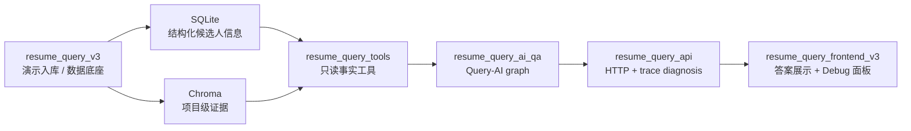
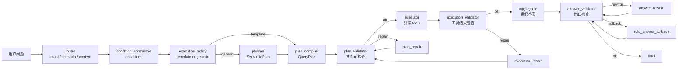

# ai-query 智能简历问答项目

`ai-query` 是一个受约束、可追踪、可回归的智能简历问答系统。它不是把简历丢给
LLM 自由发挥，而是把用户问题拆成结构化意图、条件、工具计划、工具事实和可校验答案。

一句话讲项目：

```text
简历入库提供数据底座，Query-AI 把自然语言问题变成可验证的只读工具链，再生成有 trace 的答案。
```

## 10 分钟讲法

可以按这条线讲：

1. 业务目标：对招聘简历库提问，例如“金融候选人有几个，谁最强，依据是什么？”。
2. 核心难点：LLM 容易乱查、乱排、乱编证据，所以不能让 LLM 直接回答。
3. 设计方案：让 LLM 只参与 draft，真正返回前必须经过 YAML 规则、只读 tools、三层 validator 和 trace。
4. 主链路：自然语言问题先被 router 结构化，再编译成 QueryPlan，executor 只按计划调用工具。
5. 准确性保障：plan、execution、answer 三层都校验；repair/fallback 修完必须重新校验。
6. 可排查性：每轮运行都有 trace、route、tool results、validator issues 和日志。

一句话收束：

```text
这个项目的重点不是“接一个 RAG”，而是把简历问答做成可解释、可验证、可回归的工程流水线。
```

## 系统架构



模块边界：

| 模块 | 负责 | 不做什么 |
| --- | --- | --- |
| `resume_query_v3` | 演示简历解析、chunk、embedding、写入 SQLite/Chroma。 | 不回答用户问题，不做 Query-AI 决策。 |
| `resume_query_tools` | 只读查询数据底座，返回候选人、画像、证据等事实 DTO。 | 不规划工具链，不生成最终答案，不写库。 |
| `resume_query_ai_qa` | router、planner、compiler、validator、executor、aggregator、trace。 | 不直接读写数据底座，不绕过 tools。 |
| `resume_query_api` | HTTP schema、调用 QA graph、返回答案和诊断 trace。 | 不重新判断 intent，不修改答案事实。 |
| `resume_query_frontend_v3` | 问答输入、答案展示、候选人展示、Debug 面板。 | 不补事实，不重排结果，不直接读数据库。 |

历史目录和旧实验文件只保留参考价值，不进入当前生产主链。

## 根目录文件归类

根目录里既有当前主链，也保留了一些早期实验和本地运行产物。演讲或排查时按下面理解：

| 路径 | 当前定位 | 是否进入生产主链 |
| --- | --- | --- |
| `resume_query_v3/` | 演示入库链路，负责把简历解析后写入 SQLite/Chroma。 | 是，作为数据准备链路。 |
| `resume_query_tools/` | 只读事实工具，封装数据底座查询。 | 是，供 Query-AI executor 调用。 |
| `resume_query_ai_qa/` | Query-AI 主链，负责理解、规划、执行、校验、回答和 trace。 | 是，当前重点。 |
| `resume_query_api/` | HTTP API，调用 Query-AI graph 并返回答案/诊断。 | 是。 |
| `resume_query_frontend_v3/` | 前端展示和 Debug 面板。 | 是。 |
| `shared_taxonomy/` | domain/skill/concept 等共享 taxonomy。 | 是，被条件归一化和规则层使用。 |
| `requirements.txt` | Python 依赖清单。 | 是。 |
| `pictures/` | 早期说明图片/截图素材。 | 否，仅参考。 |
| `data/` | 统一运行数据目录，包含简历输入、SQLite、Chroma、Query-AI 日志和备份。 | 否，运行时生成，源码只保留 `data/resume/.gitkeep`。 |

## 部署最小配置

部署时只保留一个根目录 `.env`。默认 OpenAI 路径下，用户只需要填：

```env
OPENAI_API_KEY=your_api_key_here
RESUME_APP_PASSWORD=change_me_before_deploy
```

推荐从 `.env.example` 复制：

```bash
cp .env.example .env
```

简历文件默认放在统一运行数据目录：

```text
data/resume/
data/resume/uploads/
```

前端“简历入库”频道支持上传单份简历，文件会持久保存到 `data/resume/uploads/`；
也可以触发批量扫描，默认扫描 `data/resume/`。入库完成后，新候选人会出现在
“候选人信息”中，并可直接被 “AI 问答” 使用。

PaaS 公网部署时建议拆成 FastAPI 后端和 Next.js 前端两个服务：

```env
RESUME_APP_PASSWORD=change_me_before_deploy
RESUME_API_ALLOWED_ORIGINS=https://your-frontend-domain
NEXT_PUBLIC_API_BASE_URL=https://your-api-domain
RESUME_DATA_ROOT=/persistent/resume-query
```

`RESUME_DATA_ROOT` 必须指向 PaaS 的持久化磁盘。SQLite、Chroma、Query-AI 日志、上传简历和批量扫描目录会统一落在 `$RESUME_DATA_ROOT/data/` 下；如果平台没有持久化磁盘，只适合部署前端或临时 demo，不适合保存候选人库。

## Query-AI 主链



白话解释：

- `router`：判断用户要什么，输出 `RouterOutput`，不查库、不回答。
- `condition_normalizer`：把 domain、skill、concept、major、candidate 等条件标准化。
- `execution_policy`：决定走稳定 workflow template，还是 generic planner。
- `planner`：只在 generic 路径生成语义步骤 `SemanticPlan`。
- `plan_compiler`：第一层允许生成 `QueryPlan / ToolCallSpec` 的节点。
- `plan_validator`：执行前检查工具、参数、依赖、scenario 合同是否合法。
- `executor`：唯一真正调用只读 tools 的节点。
- `execution_validator`：检查工具结果是否满足问题和计划。
- `aggregator`：用 question、YAML 回答框架、ToolResult 事实和 evidence 生成答案。
- `answer_validator`：出口前检查数量、候选人、排序、证据、隐私和 layout。

## 为什么不是普通 RAG / 自由 Agent

普通 RAG 更像：

```text
query -> 检索 -> LLM 总结
```

这个项目更像：

```text
query -> intent/scenario/condition -> QueryPlan -> ToolResult[] -> validated answer
```

差异点：

- LLM 不是最终权威：LLM 可以生成 draft，但 intent、scenario、tool、answer 都会被规则收口。
- 事实只来自 tools：SQLite/Chroma 事实必须通过只读工具返回，答案不能绕过工具补造。
- YAML 是规则合同：intent、scenario、tool policy、workflow、validation、answer layout 都有配置来源。
- 三层 validator：计划能不能执行、工具结果够不够、答案有没有改事实，都分层检查。
- repair/fallback 不越权：修复后必须回 validator 复检，不能直接放行。
- trace 可解释：每一步为什么这么走、哪里失败、怎么 fallback，都能从日志排查。

## 演讲时间线

如果只有 10 分钟，可以按这个节奏讲：

| 时间 | 讲什么 | 重点句 |
| --- | --- | --- |
| 1 分钟 | 项目定位 | 这是一个可验证的智能简历问答系统，不是自由聊天 RAG。 |
| 3 分钟 | 主链路 | 用户问题先结构化，再编译成 QueryPlan，executor 只按计划调只读工具。 |
| 3 分钟 | 准确性保障 | LLM 可以 draft，但 intent/tool/result/answer 都要经过规则和 validator 收口。 |
| 2 分钟 | Trace 和 benchmark | trace 解释每一步为什么这么走，benchmark 保证 policy/plan/runtime 不回归。 |
| 1 分钟 | 边界和不足 | 当前 Demo 管理接口、日志脱敏、生产权限仍需补齐，但主链边界已经清楚。 |

## 准确性保障

| 风险 | 防线 |
| --- | --- |
| intent 或场景判断错 | router LLM schema 校验、rule fallback、guard、finalizer。 |
| 条件别名混乱 | shared taxonomy 和 condition normalizer 统一 domain/skill/concept。 |
| 工具选错或参数错 | execution_policy、plan_compiler、plan_validator 按 YAML 合同检查。 |
| 工具结果为空或失败 | executor 包装 ToolResult，execution_validator 决定 fail/repair/clarify。 |
| LLM 答案乱改事实 | aggregator grounding authority + answer_validator 出口检查。 |
| 多轮上下文错 | session_context 只在 final 写回，router/context guard 负责解析引用。 |
| 线上难排查 | state trace + observability logs + scripts/query_logs。 |

## YAML 规则源

Query-AI 的业务规则优先沉淀在 `resume_query_ai_qa/configs/`，Python 负责执行和守边界。

| YAML | 主要作用 |
| --- | --- |
| `intents.yaml` | intent 定义、semantic needs、默认 JD/evidence 要求。 |
| `scenarios.yaml` | scenario catalog、allowed intents、执行语义。 |
| `router_rules.yaml` | router fallback、guard、上下文和开放召回信号。 |
| `condition_rules.yaml` | 条件抽取、清洗、taxonomy alias、preference target。 |
| `compiler_templates.yaml` | 稳定 workflow template 和 tool call binding。 |
| `tool_policy.yaml` | 工具白名单、禁用工具、fallback tool、工具 metadata。 |
| `validation.yaml` | validator、repair、retry、issue action。 |
| `evidence_policy.yaml` | 证据要求和空证据表达。 |
| `answer_layouts.yaml` | 答案布局、章节、claim contract。 |
| `aggregator_tasks.yaml` | answer task 类型和生成合同。 |
| `jd_scoring.yaml` | JD 评分权重、默认标准路径、评分开关。 |
| `llm.yaml` | LLM provider、model、timeout、retry。 |

更多细节看 [resume_query_ai_qa/configs/README.md](resume_query_ai_qa/configs/README.md)。

## 排查入口

| 现象 | 先看哪里 |
| --- | --- |
| intent、scenario、上下文引用错 | [router README](resume_query_ai_qa/nodes/router/README.md)、`router_rules.yaml`、`intents.yaml`、`scenarios.yaml`。 |
| domain/skill/candidate 条件错 | [condition_normalizer README](resume_query_ai_qa/nodes/condition_normalizer/README.md)、`condition_rules.yaml`、`shared_taxonomy/`。 |
| template/generic 路径不对 | [execution_policy README](resume_query_ai_qa/nodes/execution_policy/README.md)、`scenarios.yaml`、`compiler_templates.yaml`。 |
| ToolCallSpec 参数或 `$binding` 错 | [plan_compiler README](resume_query_ai_qa/nodes/plan_compiler/README.md)、[plan_validator README](resume_query_ai_qa/nodes/plan_validator/README.md)。 |
| 工具运行失败或 `$ref` 没绑定上 | [executor README](resume_query_ai_qa/nodes/executor/README.md)、[tools README](resume_query_ai_qa/tools/README.md)。 |
| 工具结果不够、count/rank 不一致 | [execution_validator README](resume_query_ai_qa/nodes/execution_validator/README.md)。 |
| 答案乱说、证据引用错、layout 错 | [aggregator README](resume_query_ai_qa/nodes/aggregator/README.md)、[answer_validator README](resume_query_ai_qa/nodes/answer_validator/README.md)。 |
| fallback/repair 为什么发生 | [nodes README](resume_query_ai_qa/nodes/README.md)、[scripts README](resume_query_ai_qa/scripts/README.md)、[observability README](resume_query_ai_qa/observability/README.md)。 |
| 配置交叉引用错 | [config_validation README](resume_query_ai_qa/core/config_validation/README.md)。 |

## 面试追问答案

**为什么 planner 和 compiler 分开？**

planner 只描述“要做哪些语义步骤”，compiler 才生成可执行 `QueryPlan / ToolCallSpec`。
这样 LLM planner 不能直接决定工具参数，最终工具计划仍由 deterministic compiler 和 validator 收口。

**既然 compiler 是程序写死的，为什么还要 validator？**

compiler 会消费 YAML、condition、artifact binding、上下文和工具 metadata，这些输入会变。
validator 是执行前合同闸门，防止配置错误、binding 漏洞、工具权限变化或复合 workflow 边界错误进入 executor。

**LLM 生成答案怎么防幻觉？**

aggregator 先构造 grounded answer/context，LLM 只能基于 question、layout framework、ToolResult 事实和 evidence 生成文本。
最终 `claims / used_evidence_refs` 由 grounded authority 收口，answer_validator 再检查数量、候选人、排序、证据、隐私和 layout。

**空结果怎么办？**

hard filter 空结果是事实答案，不扩大召回；open recall 空候选才允许受控 query fallback。
证据工具正常返回 0 条 evidence 时，答案表达“未查到/不能确认”，并记录 warning。

**系统怎么证明自己走对了？**

每轮运行都有 trace：router 输出、policy 决策、compiled plan、tool results、validator issues、route events、fallback/repair 和最终答案。
本地可用 `resume_query_ai_qa.scripts.query_logs` 看 summary/detail。

## 启动

后端 API：

```bash
./.venv/bin/uvicorn resume_query_api.main:app --host 127.0.0.1 --port 8000
```

PaaS 后端启动命令：

```bash
uvicorn resume_query_api.main:app --host 0.0.0.0 --port $PORT
```

前端：

```bash
cd resume_query_frontend_v3
./scripts/use-node.sh
npm install
npm run dev:local
```

PaaS 前端构建/启动：

```bash
npm run build
npm run start -- -p $PORT
```

访问：

```text
http://127.0.0.1:3000
```

健康检查：

```text
http://127.0.0.1:8000/health
```

## 验收命令

后端：

```bash
.venv/bin/python -m compileall -q resume_query_ai_qa resume_query_api resume_query_tools
.venv/bin/python resume_query_ai_qa/benchmarks/run_policy_contract_benchmark.py
.venv/bin/python resume_query_ai_qa/benchmarks/run_plan_contract_benchmark.py
.venv/bin/python resume_query_ai_qa/benchmarks/run_runtime_contract_benchmark.py
```

前端：

```bash
cd resume_query_frontend_v3
./scripts/use-node.sh
npm run build
```

`npm run lint` 当前可能触发 Next.js 首次 ESLint 配置交互；在补非交互 ESLint 配置前，
上线阻塞项以 `npm run build` 的类型检查和构建结果为准。

## 阅读顺序

1. 总项目入口：本文件。
2. Query-AI 主链：[resume_query_ai_qa/README.md](resume_query_ai_qa/README.md)。
3. 全节点地图：[resume_query_ai_qa/nodes/README.md](resume_query_ai_qa/nodes/README.md)。
4. 节点读代码路线：[resume_query_ai_qa/nodes/NODES_FLOW.md](resume_query_ai_qa/nodes/NODES_FLOW.md)。
5. Graph 编排：[resume_query_ai_qa/graph/README.md](resume_query_ai_qa/graph/README.md)。
6. Core 底座：[resume_query_ai_qa/core/README.md](resume_query_ai_qa/core/README.md)。
7. YAML 配置：[resume_query_ai_qa/configs/README.md](resume_query_ai_qa/configs/README.md)。
8. 只读工具：[resume_query_ai_qa/tools/README.md](resume_query_ai_qa/tools/README.md)。
9. 合同测试：[resume_query_ai_qa/benchmarks/README.md](resume_query_ai_qa/benchmarks/README.md)。
10. API 入口：[resume_query_api/README.md](resume_query_api/README.md)。
11. 前端展示：[resume_query_frontend_v3/README.md](resume_query_frontend_v3/README.md)。
