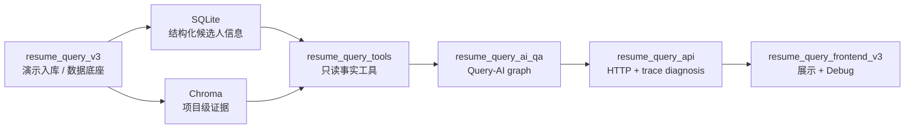
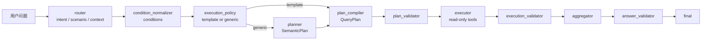

# ai-query 智能简历问答项目

`ai-query` 是一个面向招聘简历库的 Query-AI 演示系统。当前生产级重点是
`resume_query_ai_qa` 问答主链：用户问题必须被拆成可验证的 intent、condition
和 tool plan，事实只能来自只读 tools，最终答案必须经过 validator 和 trace
约束。

一句话：

```text
演示入库准备数据，Query-AI 负责可观测、可追溯、可扩展的简历问答。
```

## 项目定位

本项目不是自由 Agent，也不是通用文档搜索。它是一套受约束的 Query-AI pipeline：

- LLM 可以参与理解、规划和表达，但不能直接查库、写库或绕过工具。
- SQLite/Chroma 中的候选人事实只能通过 `resume_query_tools` 暴露。
- Query-AI 主链必须经过 compiler、validator、executor、answer validator。
- 前端只展示 API 返回的答案、证据、诊断和 debug trace，不补事实、不重排结果。

## 部署主链



## 模块责任边界

| 模块 | 负责 | 不负责 |
|---|---|---|
| `resume_query_v3` | 演示简历解析、写入 SQLite/Chroma。 | 不回答问题，不做 Query-AI 决策。 |
| `resume_query_tools` | 只读查询 SQLite/Chroma，返回事实 DTO。 | 不规划、不总结、不写库。 |
| `resume_query_ai_qa` | router、planner、compiler、validator、executor、aggregator、trace。 | 不直接写数据底座，不绕过 tools。 |
| `resume_query_api` | HTTP schema、调用 QA graph、返回最小 diagnosis 和 debug trace。 | 不重新判断 intent，不修改答案事实。 |
| `resume_query_frontend_v3` | 问答输入、答案展示、候选人展示、Debug 面板。 | 不补事实、不重排、不直接读数据库。 |

历史目录如 `rewrite_v1`、`resume_query_v2` 不进入部署主链，仅保留参考价值。

## Query-AI 主链



主链原则：

- `router` 判断用户要什么、怎么执行以及上下文引用，输出 `intent / scenario_decisions / context_policy`，不选工具参数。
- `condition_normalizer` 使用共享 taxonomy 标准化 domain/skill/concept/major 条件。
- `execution_policy` 只读取 router-owned scenario，决定 template/generic，不重新判断 scenario、不编译工具。
- `planner` 只在 generic 路径生成 `SemanticPlan`，不执行工具。
- `plan_compiler` 是第一层允许生成 `ToolCallSpec` 的节点。
- `validator` 分别守住 plan、tool result、answer 三层边界。
- `executor` 是唯一调用只读 tools 的节点。
- `aggregator` 只能表达工具事实，不能新增事实。

## YAML 规则源与共用边界

Query-AI 生产主链的规则必须有明确归属，节点不能各自维护一套 YAML 或私有别名表。

| 规则源 | 归属 | 共用边界 |
|---|---|---|
| `resume_query_ai_qa/configs/*.yaml` | QA runtime 配置，由 `resume_query_ai_qa/core/config.py::load_config()` 统一读取。 | router、policy、compiler、validator、repair、aggregator 通过 `ResumeQAConfig` 和 `core/rules/*` 消费。 |
| `shared_taxonomy/*` | domain/concept/skill/major 的共享 taxonomy。 | QA 代码只能通过 `resume_query_ai_qa/core/rules/taxonomy.py` 访问，不允许 node/tool 直接读 YAML 或维护别名表。 |
| `resume_query_v3/configs/*.yaml` | 演示入库链路配置。 | 不参与 Query-AI runtime 的 intent/scenario/tool/answer 决策。 |
| `resume_query_api` / `resume_query_frontend_v3` | HTTP schema、trace diagnosis 和展示层。 | 只展示 QA 返回的答案、证据和 trace，不重新判断规则、不补事实。 |

Compiler、validator、repair 不是三套规则：`plan_compiler` 负责按 template/tool policy
生成 `QueryPlan`，`plan_validator` 负责只读校验同一份 plan/tool/scenario 合同，
`plan_repair` 和 `execution_repair` 只能按 `validation.yaml`、`tool_policy.yaml`、
`core/rules/plan_building.py` 的共享规则修复，修复后必须回到 validator 复核。

## 当前进展

已完成并通过回归的 Query-AI 能力：

- template/generic 双路径：稳定问题走 workflow template，开放问题走 generic planner。
- hard filter 与 open recall 分流：硬条件严格结构化筛选，开放召回允许 hybrid search。
- 0 证据可回答：证据工具正常返回空列表时，答案表达“未查到/不能确认”，并记录
  `empty_evidence` warning。
- 三层 validator：plan、execution、answer 都有独立错误和 repair/fallback 路由。
- 可观测性：默认 `/qa/ask` 返回最小 `trace.diagnosis`；`debug=true` 返回完整
  `decision_steps`、`route_events`、tools、validator errors、compiled plan 和 log hint。
- 前端 Debug 面板：能展示诊断摘要、主链路、route events、fallback/repair、工具状态和原始证据。

## Demo 边界

当前 `POST /ingestion/resumes`、简历文件预览和下载接口用于本地演示与调试，不包装成生产安全能力。

生产化前需要补齐：

- 管理接口鉴权。
- 入库目录白名单和路径 containment。
- Query-AI detail 日志脱敏、访问权限、保留周期和清理策略。
- 外部 LLM 调用前的数据脱敏或明确授权。

## 启动

后端 API：

```bash
./.venv/bin/uvicorn resume_query_api.main:app --host 127.0.0.1 --port 8000
```

前端：

```bash
cd resume_query_frontend_v3
./scripts/use-node.sh
npm install
npm run dev:local
```

访问：

```text
http://127.0.0.1:3000
```

健康检查：

```text
http://127.0.0.1:8000/health
```

## 上线验收

后端必跑：

```bash
.venv/bin/python -m compileall -q resume_query_ai_qa resume_query_api resume_query_tools
.venv/bin/python resume_query_ai_qa/benchmarks/run_runtime_contract_benchmark.py
.venv/bin/python resume_query_ai_qa/benchmarks/run_plan_contract_benchmark.py
.venv/bin/python resume_query_ai_qa/benchmarks/run_plan_contract_benchmark.py
.venv/bin/python resume_query_ai_qa/benchmarks/run_plan_contract_benchmark.py
.venv/bin/python resume_query_ai_qa/benchmarks/run_policy_contract_benchmark.py
.venv/bin/python resume_query_ai_qa/benchmarks/run_runtime_contract_benchmark.py
.venv/bin/python resume_query_ai_qa/benchmarks/run_plan_contract_benchmark.py
```

前端必跑：

```bash
cd resume_query_frontend_v3
./scripts/use-node.sh
npm run build
```

`npm run lint` 当前会触发 Next.js 首次 ESLint 配置交互；在补非交互 ESLint 配置前，
上线阻塞项以 `npm run build` 的类型检查和构建结果为准。

## 阅读顺序

1. 新人单一入口：[docs/ONBOARDING.md](docs/ONBOARDING.md)
2. 修改入口地图：[docs/CHANGE_GUIDE.md](docs/CHANGE_GUIDE.md)
3. 总览和边界：本文件。
4. Query-AI 主链：[resume_query_ai_qa/README.md](resume_query_ai_qa/README.md)
5. 节点索引：[resume_query_ai_qa/nodes/README.md](resume_query_ai_qa/nodes/README.md)
6. API 和 trace 字段：[resume_query_api/README.md](resume_query_api/README.md)
7. 日志排查：[QUERY_AI_LOGS.md](QUERY_AI_LOGS.md)
8. 部署验收：[resume_query_ai_qa/benchmarks/DEPLOYMENT_ACCEPTANCE.md](resume_query_ai_qa/benchmarks/DEPLOYMENT_ACCEPTANCE.md)

`resume_query_ai_qa/TASK_SUMMARY.md` 是历史实施记录，不是当前行为的 source of truth。
