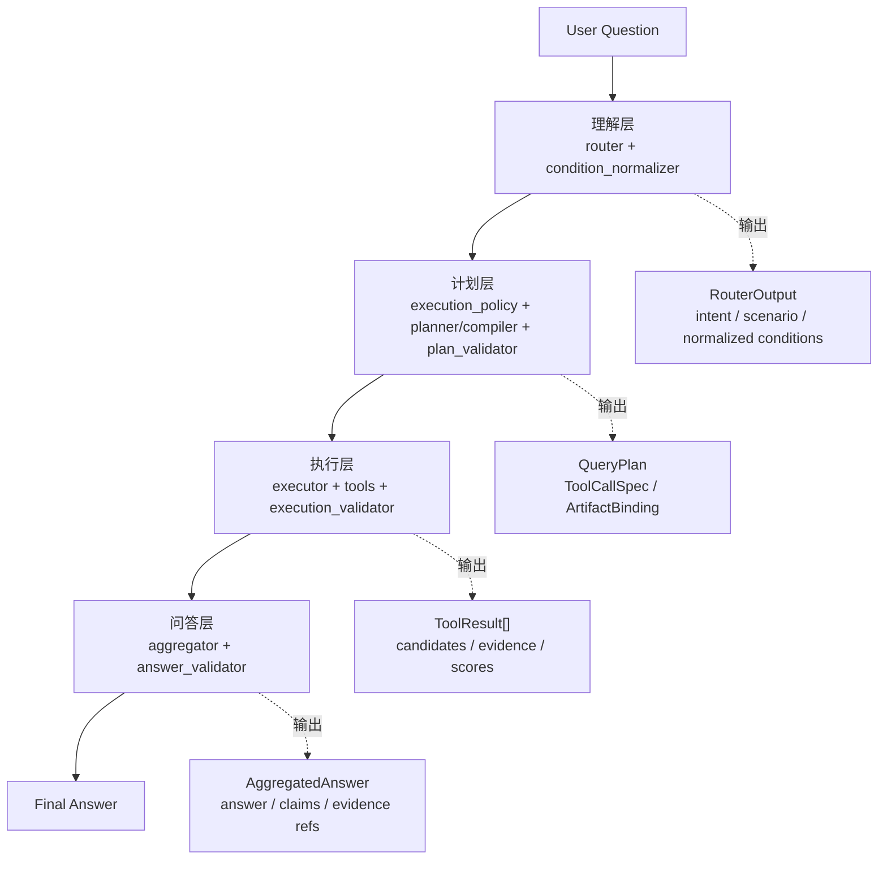
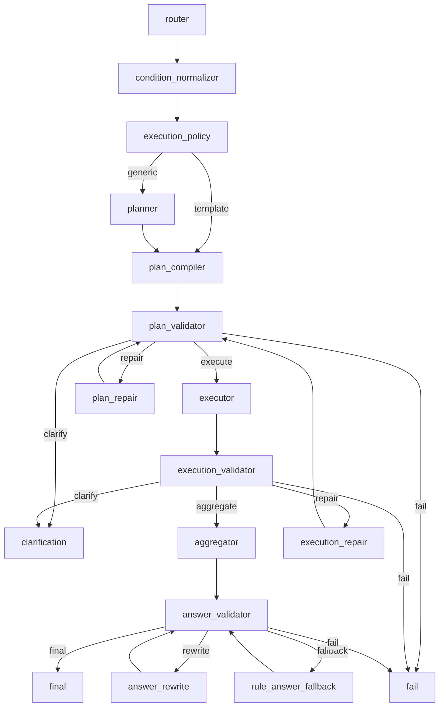

# Query-AI 架构讲解文档

这份文档用于面试讲解和前端演示串讲。讲解顺序是：先总览，再四层架构，再用一个问题走完整链路，最后补充 validator、repair/fallback、log/trace 和代码位置。

## 目录

1. 项目定位
2. 四层总架构
3. 四层逐层讲解
4. 贯穿例子：推荐运营领域的候选人
5. Validator / Repair / Fallback
6. Log / Trace
7. 详细 Graph 流转图
8. 巧思点与收益
9. 术语速查
10. 前端演示串词
11. 代码讲解路径
12. 面试收束话术

## 1. 项目定位

Query-AI 是简历问答系统里的主链路。它不是简历入库系统，也不是简单 RAG。

它解决的问题是：用户用自然语言问简历问题时，系统不能直接把问题丢给 LLM 自由回答，而要把问题拆成一条可控、可验证、可回归的工程链路。

核心链路：

```text
自然语言简历问题
-> 结构化理解
-> 可验证 QueryPlan
-> 只读工具执行
-> 基于工具事实生成答案
-> validator 校验后返回
```

一句话讲法：

```text
Query-AI 的核心不是让 LLM 直接回答简历问题，而是把简历问答拆成理解、计划、执行、问答四层。
LLM 可以参与 draft 和表达，但工具调用、候选人来源、排序、证据和最终答案都被规则、validator、benchmark 和 trace 约束住。
```

不做什么：

- 不解析原始简历文件。
- 不做简历入库、chunking、embedding 或索引构建。
- 不写 SQLite、Chroma 或候选人数据。
- 不绕过 tools 直接读取底层数据。
- 不绕过 validator 直接把 LLM 输出给用户。

## 2. 四层总架构

面试开场先讲四层图，不直接讲完整 LangGraph。



| 层级 | 解决什么问题 | 输入 | 输出 | 代码位置 |
| --- | --- | --- | --- | --- |
| 理解层 | 自然语言歧义、别名混乱、误筛选。 | 用户问题、session context | `RouterOutput`、normalized conditions | `nodes/router`、`nodes/condition_normalizer` |
| 计划层 | LLM 工具调用不可控、参数易错。 | `RouterOutput`、normalized conditions、YAML policy | `QueryPlan`、`ToolCallSpec` | `nodes/execution_policy`、`nodes/planner`、`nodes/plan_compiler`、`nodes/plan_validator` |
| 执行层 | 工具失败和业务空结果混杂。 | `QueryPlan` | `ToolResult[]` | `nodes/executor`、`tools`、`nodes/execution_validator` |
| 问答层 | 答案幻觉、排序漂移、证据乱引。 | `ToolResult[]`、query、layout | `AggregatedAnswer` | `nodes/aggregator`、`core/answer_generation`、`nodes/answer_validator` |

四层图的讲解重点：

```text
不是一个 LLM 端到端回答，而是每层都有明确输入输出。
LLM 可以参与 draft，但不能直接决定工具调用和最终事实。
```

## 3. 四层逐层讲解

### 3.1 理解层：先把自然语言变成结构化条件

对应代码：

- [nodes/router/README.md](nodes/router/README.md)
- [nodes/condition_normalizer/README.md](nodes/condition_normalizer/README.md)

这一层做两件事：

- `router` 识别用户意图：筛选、证据查找、画像、排序推荐、候选人比较、范围外问题。
- `condition_normalizer` 归一化查询条件：domain、skill、concept、major、candidate name、scope、上下文指代。

例子：

```text
推荐运营领域的候选人
```

应该理解成：

```text
推荐 = 动作 / 推荐 / 排序语义
运营领域 = domain=Operations
不应该抽成 concept=推荐系统
```

巧思点：

- 先结构化，再查询。tools 不需要每次重新理解自然语言。
- 条件归一化让“运营”“运营领域”“Operations”最终落到同一类条件。
- 动作词和 taxonomy concept 分开处理，减少筛选误判。

收益：

- 查询更快。
- 筛选更准。
- 后续 plan、tools、validator 都消费统一字段。

### 3.2 计划层：template + LLM draft + compiler + validator

对应代码：

- [nodes/execution_policy/README.md](nodes/execution_policy/README.md)
- [nodes/planner/README.md](nodes/planner/README.md)
- [nodes/plan_compiler/README.md](nodes/plan_compiler/README.md)
- [nodes/plan_validator/README.md](nodes/plan_validator/README.md)

计划层是最容易被追问的部分。核心回答是：

```text
LLM 只生成语义 draft，不直接生成权威工具调用；
真正可执行的 QueryPlan 由规则 compiler 生成，并由 validator 硬校验。
```

两条计划路径：

```text
template 路径：
router -> condition_normalizer -> execution_policy -> plan_compiler

generic 路径：
router -> condition_normalizer -> execution_policy -> planner -> plan_compiler
```

template 是成熟链路沉淀：

- 适合高频、稳定、有明确工具顺序的问题。
- 通过 `compiler_templates.yaml`、`tool_policy.yaml` 和规则匹配。
- 例如候选人画像、候选人计数、候选人列表、稳定筛选、稳定排序 workflow。

LLM/planner 是有边界的自由发挥：

- 可以表达“这个问题大概要查什么”“可能需要哪些工具”。
- 输出 `SemanticPlan` 或 `tool_hints` draft。
- 不直接调用工具，不直接返回最终答案，不生成绕过校验的工具调用。

`plan_compiler` 才生成可执行计划：

- 生成 `QueryPlan`。
- 生成 `ToolCallSpec`。
- 绑定 `$ref`、候选人来源、候选人池、排序结果、证据输入。
- 建立 `ArtifactBinding`，让 validator/executor 知道产物来源和消费者。

`plan_validator` 做硬校验：

- 工具是否存在于 registry。
- 工具是否被 `tool_policy.yaml` 允许。
- 参数是否支持。
- `$ref` 是否能绑定到上游产物。
- `depends_on` / `output_key` 是否形成合法依赖。
- ranking、profile、evidence 是否来自同一个候选人来源。
- intent / scenario 是否允许当前工具组合。

巧思点：

- template 提供稳定性。
- LLM/planner 提供开放表达能力。
- compiler 把 draft 收口成规则计划。
- validator 阻止错误计划进入执行。

收益：

- 防止 LLM 编工具名、编参数。
- 工具调用可审计、可复现。
- 新增稳定链路时优先改 YAML/template。
- 出错时 trace 能定位是理解错、编译错，还是校验失败。

### 3.3 执行层：只读 tools + 结构化失败分类

对应代码：

- [nodes/executor/README.md](nodes/executor/README.md)
- [tools/README.md](tools/README.md)
- [nodes/execution_validator/README.md](nodes/execution_validator/README.md)
- [nodes/execution_repair/README.md](nodes/execution_repair/README.md)

执行层原则：

```text
executor 只按 QueryPlan 执行；
tools 只返回事实；
execution_validator 判断工具结果是否足够、安全、自洽。
```

`executor` 不重新判断 intent，不选择工具，不生成答案。它只看 `QueryPlan`。

`tools` 可以做：

- 候选人筛选。
- 候选人计数。
- 候选人画像。
- 证据检索。
- JD 评分。
- 排序。
- 对比材料组装。

`tools` 不做：

- 不判断 intent。
- 不生成自然语言答案。
- 不修改候选人数据。
- 不决定最终 route。

执行层失败可以按四类讲：

| 分类 | 含义 | 典型处理 |
| --- | --- | --- |
| 工具失败 | 工具内部异常或执行失败。 | 通常 fail，避免坏结果继续生成答案。 |
| 必需结果缺失 | 当前 intent 必须有的工具结果没拿到。 | 按 issue action repair / clarify / fail。 |
| 证据不足 | 需要 evidence 的问题没有足够 EvidenceRef。 | 可回答空证据或 fail，取决于策略。 |
| 结果不一致 | count、ranking、candidate pool、evidence lineage 不自洽。 | 阻断，避免答案跑出候选人池。 |

实现里更细，是五类检查：

```text
tool failure
required results
evidence coverage
result consistency
candidate lineage
```

candidate lineage 很有讲点：

```text
filter_candidates -> candidate_pool = [A, B, C]
rank_candidates -> ranked_candidates = [A, B, D]
```

这里 `D` 不在候选人池里，validator 会阻断，防止排序、画像、证据跑出本轮候选人集合。

Retry 只解决瞬时工具失败，不改变业务语义；业务上的空结果或证据不足交给 validator 和 repair/fallback 处理。

### 3.4 问答层：layout + tool context + query

对应代码：

- [nodes/aggregator/README.md](nodes/aggregator/README.md)
- [core/answer_generation/](core/answer_generation/)
- [nodes/answer_validator/README.md](nodes/answer_validator/README.md)
- [nodes/answer_rewrite/README.md](nodes/answer_rewrite/README.md)
- [nodes/rule_answer_fallback/README.md](nodes/rule_answer_fallback/README.md)

心智模型：

```text
aggregator = query + YAML layout/task + tool context + evidence -> AggregatedAnswer
```

aggregator 会准备：

```text
query_frame
rule_draft
grounded_context
selected_evidence
tool_results_summary
prompt_payload
```

LLM 可以做：

- 把答案写得更自然。
- 按 layout 组织段落。
- 解释排序理由。
- 总结证据。

LLM 不能做：

- 新增候选人。
- 改 count。
- 重排 ranking。
- 新增 evidence id。
- 泄露默认隐藏的联系方式。
- 编造工具结果里没有的事实。

关键收口规则：

```text
answer = LLM answer text 或 grounded fallback answer
claims = grounded claims
used_evidence_refs = grounded evidence refs
warnings = grounded warnings + LLM warnings
```

`answer_validator` 同时检查两条线。

第一条：structured claims。

- count 是否等于 `count_candidates`。
- candidate name 是否来自工具结果。
- ranking 是否等于 `rank_candidates`。
- evidence id 是否真实存在。
- 必需 structured claims 是否存在。

第二条：LLM 原文关键事实。

- 文本里的数量是否乱写。
- 排序文本中的候选人顺序是否被改。
- 是否泄露联系方式或敏感属性。
- layout 标题和章节顺序是否符合 YAML。
- 空证据时是否说明“未查到/不能确认”。

边界：

```text
当前不是逐句做自然语言蕴含校验；
它重点硬校验数量、候选人、排序、证据、隐私、layout 这些高风险事实。
```

## 4. 贯穿例子：推荐运营领域的候选人

前端演示可以用这个问题：

```text
推荐运营领域的候选人
```

理解层：

```text
router 识别这是候选人推荐 / 排序语义
condition_normalizer 抽取 domain=Operations
推荐是动作词，不抽成 concept=推荐系统
```

计划层：

```text
execution_policy 判断走 template 还是 generic
planner 如果参与，只生成 SemanticPlan / tool_hints
plan_compiler 编译成 QueryPlan
plan_validator 校验工具、参数、候选人来源、依赖
```

执行层：

```text
executor 调用 filter_candidates / scoring / ranking 相关 tools
tools 返回运营候选人、评分、排序、证据
execution_validator 检查结果齐全、排序没跑出候选人池
```

问答层：

```text
aggregator 按 layout 组织答案
answer_validator 校验数量、排序、证据、隐私
final 返回答案
```

## 5. Validator / Repair / Fallback

三层 validator：

| Validator | 防什么 |
| --- | --- |
| `plan_validator` | 防错误计划进入执行层。 |
| `execution_validator` | 防坏工具结果进入答案层。 |
| `answer_validator` | 防答案幻觉、排序漂移、证据乱引、隐私泄露。 |

Repair / Fallback 核心原则：

```text
哪一层出问题，就只修哪一层；
修完必须回到对应 validator；
不从头重跑，不绕过验证。
```

为什么不从头来：

- 上游结果可能已经通过校验，没必要丢掉。
- 从头重跑可能引入新的 LLM 不确定性。
- 成本更高。
- trace 更难定位问题。
- 分层 repair 能明确说明“哪一层出了什么问题”。

各层 repair：

| Repair | 修什么 | 不修什么 |
| --- | --- | --- |
| `plan_repair` | 修非法 `QueryPlan`，比如依赖、工具策略、语义合同问题。 | 不调用工具，不生成答案。 |
| `execution_repair` | 修少数安全执行问题，比如 `open_recall + empty_retrieval` 的 query fallback。 | 不修 hard filter 空结果，不修工具内部异常，不修 evidence 正常 0 条。 |
| `answer_rewrite` | 修答案表达、layout、claim 缺失等问题。 | 不改工具事实，不重排，不新增证据。 |
| `rule_answer_fallback` | LLM 失败、事实漂移、layout 违约时用规则答案兜底。 | 不绕过 answer validator。 |

典型例子：

```text
找找可能和金融风控相关的人
```

这是 open recall。如果结构化筛选为空，`execution_repair` 可以把 `filter_candidates` 替换成配置里的 fallback recall tool，例如 `hybrid_search_candidates`。

但如果用户问：

```text
金融领域候选人有哪些？
```

这是 hard filter。空结果就是事实答案，不能擅自扩大召回。

## 6. Log / Trace

对应位置：

- [observability/README.md](observability/README.md)
- [state/README.md](state/README.md)
- [scripts/README.md](scripts/README.md)

每轮运行都有 trace id。trace 和 logs 会记录：

- router 输出。
- scenario 决策。
- compiled plan。
- tool results。
- validator errors。
- route events。
- repair/fallback 原因。
- final status。

常用命令：

```bash
.venv/bin/python -m resume_query_ai_qa.scripts.query_logs list --limit 5
.venv/bin/python -m resume_query_ai_qa.scripts.query_logs show <trace_id>
.venv/bin/python -m resume_query_ai_qa.scripts.query_logs failures --limit 5
```

面试讲法：

```text
如果前端演示时答案不符合预期，我不是只能看最终输出；
我可以通过 trace 看到是 router 理解错、plan 编译错、工具结果不够，还是 answer validator 拦住了。
```

## 7. 详细 Graph 流转图

先讲四层图；面试官追问真实运行链路时，再讲完整 Graph 流转图。



这张图的讲法：

- 主成功路径是 router 到 final。
- plan 失败走 `plan_repair`，修完回 `plan_validator`。
- 执行结果失败走 `execution_repair`，修完回 `plan_validator`。
- 答案失败走 `answer_rewrite` 或 `rule_answer_fallback`，修完回 `answer_validator`。
- clarify / fail 是明确终止出口，不会继续硬跑工具。

## 8. 巧思点与收益

| 巧思点 | 为什么这么做 | 解决的问题 | 收益 |
| --- | --- | --- | --- |
| 四层拆分 | 把理解、计划、执行、回答分开。 | 端到端黑盒不可控。 | 每层可解释、可测试。 |
| router + condition normalizer | 先结构化自然语言。 | 歧义、别名、误筛选。 | 查询更快，筛选更准。 |
| template + generic | 高频稳定走模板，开放问题走 planner。 | 只靠 LLM 不稳定，只靠规则覆盖不够。 | 稳定性和灵活性兼顾。 |
| compiler + validator | draft 先编译，再硬校验。 | LLM 工具调用不可控。 | QueryPlan 可审计、可复现。 |
| read-only tools | 工具只拿事实。 | 工具层职责膨胀、误下结论。 | 数据来源清楚。 |
| execution validator | 工具结果统一校验。 | 工具失败和业务空结果混杂。 | 失败可分类、可 repair。 |
| grounded answer | LLM 写文本，规则收口事实。 | 答案幻觉、证据乱引。 | 表达自然，事实可信。 |
| 分层 repair | 哪层坏修哪层。 | 从头重跑成本高、不可控。 | 成本低、trace 清楚。 |
| trace/log | 每步记录。 | 复杂链路不可排查。 | 可观测、可复盘。 |
| benchmark | 用合同测试守行为。 | 改规则容易误伤。 | 可回归。 |

最终收益：

```text
可控、可解释、可回归、可观测
```

- 可控：LLM 不直接决定工具调用和最终事实。
- 可解释：每层都有输入输出，trace 能解释 route。
- 可回归：benchmark 守住 router、plan、runtime 行为。
- 可观测：日志能定位 validator、fallback、repair 的原因。

## 9. 术语速查

| 术语 | 面试讲法 |
| --- | --- |
| `RouterOutput` | router 输出的结构化理解结果，包含 intent、scenario、conditions、context。 |
| `SemanticPlan` | planner 的语义计划或 tool hints，还不是可执行计划。 |
| `QueryPlan` | compiler 生成的可执行计划，executor 只按它执行。 |
| `ToolCallSpec` | 单个工具调用的名称、参数、依赖和输出 key。 |
| `ArtifactBinding` | 工具产物的来源、类型、scope 和消费者关系。 |
| `ToolResult` | 工具执行结果，包含 success/failure、data、error。 |
| `AggregatedAnswer` | aggregator 生成的答案对象，包含 answer、claims、evidence refs、warnings。 |
| `ValidationResult` | validator 输出的校验结果，决定下一跳。 |
| `route_events` | 记录 graph 为什么进入 execute、repair、fallback、fail。 |
| `decision_steps` | 面向诊断的节点摘要，帮助解释每一步发生了什么。 |

## 10. 前端演示串词

演示问题：

```text
推荐运营领域的候选人
```

可以这样讲：

```text
这里用户看到的是一个自然语言问题，但后端第一步不是直接问 LLM。
它会先通过 router 判断这是候选人推荐/排序类问题，再把“运营领域”归一化成 domain=Operations。

然后系统会生成 QueryPlan。成熟链路会走 template，开放问题会走 planner draft，
但最终都必须由 plan_compiler 编译成可执行计划，并通过 plan_validator。

执行时 executor 只按 QueryPlan 调只读 tools，比如筛选候选人、评分、排序、取证据。
工具结果会经过 execution_validator，确认结果齐全、排序没有跑出候选人池。

最后 aggregator 根据 tool context 和 layout 组织答案。
LLM 可以负责表达，但答案里的数量、排序、证据引用和隐私都会被 answer_validator 校验。
所以最终用户看到的不是 LLM 自由发挥，而是经过工具事实和 validator 收口后的答案。
```

## 11. 代码讲解路径

如果面试官要求看代码，按这个顺序打开：

1. 总入口和边界：[README.md](README.md)
2. 四层节点索引：[nodes/README.md](nodes/README.md)
3. 理解层：
   - [nodes/router/README.md](nodes/router/README.md)
   - [nodes/condition_normalizer/README.md](nodes/condition_normalizer/README.md)
4. 计划层：
   - [nodes/execution_policy/README.md](nodes/execution_policy/README.md)
   - [nodes/planner/README.md](nodes/planner/README.md)
   - [nodes/plan_compiler/README.md](nodes/plan_compiler/README.md)
   - [nodes/plan_validator/README.md](nodes/plan_validator/README.md)
5. 执行层：
   - [nodes/executor/README.md](nodes/executor/README.md)
   - [tools/README.md](tools/README.md)
   - [nodes/execution_validator/README.md](nodes/execution_validator/README.md)
6. 问答层：
   - [nodes/aggregator/README.md](nodes/aggregator/README.md)
   - [core/answer_generation/](core/answer_generation/)
   - [nodes/answer_validator/README.md](nodes/answer_validator/README.md)
7. Repair / fallback：
   - [nodes/plan_repair/README.md](nodes/plan_repair/README.md)
   - [nodes/execution_repair/README.md](nodes/execution_repair/README.md)
   - [nodes/answer_rewrite/README.md](nodes/answer_rewrite/README.md)
   - [nodes/rule_answer_fallback/README.md](nodes/rule_answer_fallback/README.md)
8. Trace / logs：
   - [observability/README.md](observability/README.md)
   - [state/README.md](state/README.md)
   - [scripts/README.md](scripts/README.md)

## 12. 面试收束话术

```text
这个项目的价值不是简单接入 LLM，而是把简历问答从一个黑盒生成问题，
拆成理解、计划、执行、问答四个可验证阶段。

LLM 可以参与理解和表达，但工具调用、候选人来源、排序、证据和最终答案都被规则、
validator、benchmark 和 trace 约束住。

所以它最后实现的是一个可控、可解释、可回归、可观测的简历问答 Agent 主链路。
```
