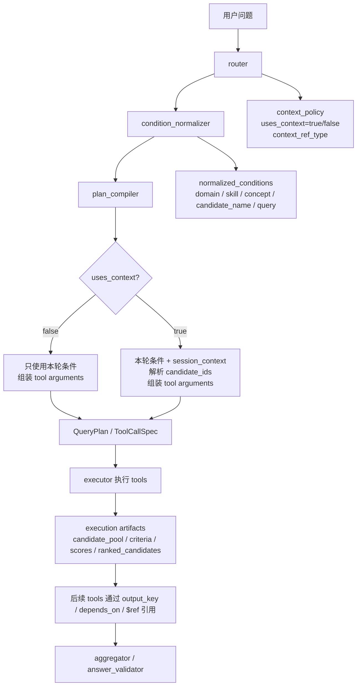
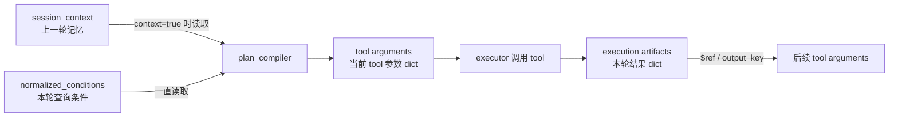
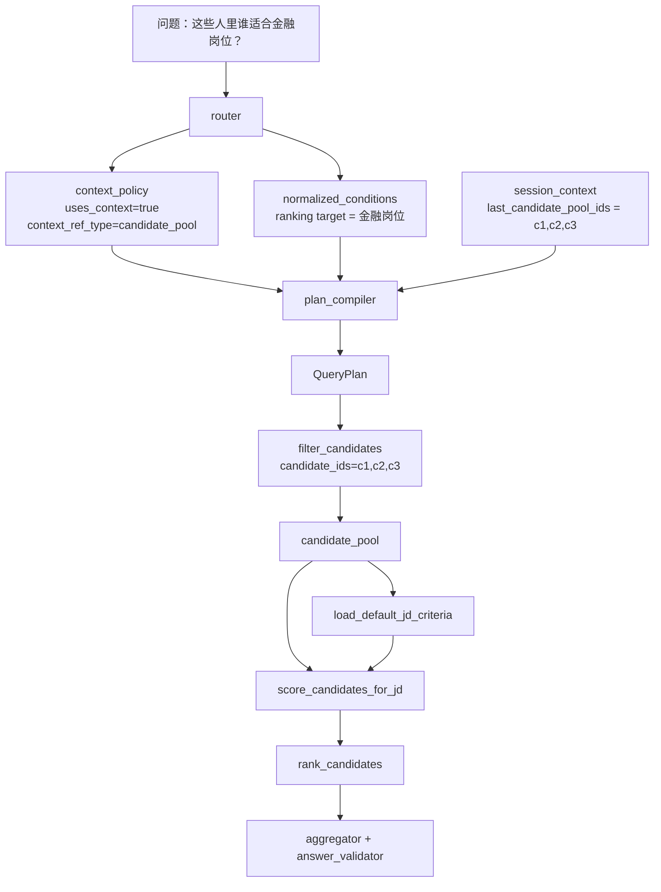
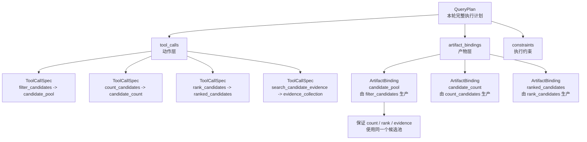
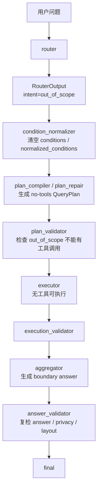
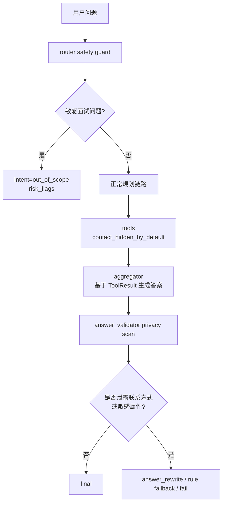

# Query-AI 面试疑问速查

这份文档用于持续记录面试中容易被追问的问题。它不是完整架构说明，而是
“分类疑问库”：每一类问题都保留核心结论、联动图、精简问答、代码位置和面试讲法。

完整架构说明看 `ARCHITECTURE_GUIDE.md`，目录级职责看各子目录 README。

## 使用方式

- 先看“分类目录”，定位问题属于哪一类。
- 每一类先背“一句话结论”，再看联动图。
- 图是高价值讲解资产，后续新增问题时优先补到对应分类里。
- 精简问答只保留面试追问时最容易卡住的边界，不写成长篇源码手册。

## 分类目录

| 分类 | 主题 | 当前状态 |
| --- | --- | --- |
| A | 上下文、候选池与工具数据流 | 已整理 |
| B | Router 与意图识别 | 待补充 |
| C | Plan / Compiler / Validator | 已整理 |
| D | Executor / Tool / 数据源 | 待补充 |
| E | Aggregator / Answer Validator | 待补充 |
| F | Repair / Fallback / Trace | 待补充 |
| G | 安全边界：out_of_scope 与隐私安全 | 已整理 |

后续新增分类时沿用这个模板：

```md
## X. 分类名

### 这一类问题在问什么
### 一句话结论
### 联动图
### 精简问答
### 代码位置
### 面试讲法
```

## A. 上下文、候选池与工具数据流

### 这一类问题在问什么

这一类问题集中在：

- 上一轮记忆什么时候被识别、什么时候进入 `QueryPlan`。
- `uses_context=false` 时，本轮候选池从哪里来。
- `uses_context=true` 时，上一轮候选范围怎么变成 `candidate_ids`。
- `tool_policy.yaml`、tool arguments、executor artifacts 分别负责什么。
- `candidate_pool` 到底是不是本轮执行结果字典里的 key。

### 一句话结论

```text
本轮条件决定查什么；
上一轮上下文决定在谁里面查；
executor 不重新理解问题，只执行 compiler 编译好的 QueryPlan。
```

`uses_context=false` 和 `uses_context=true` 不是两套系统。
它们都走 compiler -> QueryPlan -> executor -> artifacts。
区别是 `uses_context=true` 时，compiler 会额外从 `session_context` 解析
`candidate_ids`，并注入 tool arguments。

### 联动图 1：context=false / context=true 是同一条链路



讲这张图时，只强调一件事：上下文不是另一套执行系统，而是多了一个
`candidate_ids` 范围约束。

### 联动图 2：三个容器不要混



三个容器的区别：

```text
session_context
= 上一轮/多轮记忆
= last_candidate_pool_ids / last_ranking_candidate_ids / last_candidate_id

tool arguments
= 当前某个 tool 的参数 dict
= domains_any / skills_all / concepts_all / candidate_ids

execution artifacts
= 本轮工具执行结果 dict
= candidate_pool / criteria / scores / ranked_candidates
```

### 联动图 3：例子，`这些人里谁适合金融岗位`



这张图适合回答“上一轮信息怎么进入当前轮计划”。
重点是：`candidate_pool` 不是凭空来的，要么来自本轮 candidate source tool，
要么由上一轮 `session_context` 先约束成 `candidate_ids`，再由工具执行产出。

### 精简问答

**Q1：上一轮记忆是哪一轮被放进 `QueryPlan` 的？**

上一轮只负责沉淀 `session_context`。当前轮 router 识别上下文引用，
当前轮 `plan_compiler` 根据 `context_policy + session_context` 生成
`candidate_ids`，并写进 `QueryPlan` 的 tool arguments。

**Q2：`context_policy` 是 LLM 给的，还是规则给的？**

LLM 可以给 `RouterOutput` 草稿，包括 `context_policy`。
但上下文引用是高风险字段，router guard 会根据 `router_rules.yaml` 的确定性词表纠偏。
如果命中“第一名”“这些人”“这两个人”等明确指代词，会整体替换
`context_policy`。

常见映射：

```text
第一名 / top1 -> ranking_top
前三名 / top3 -> ranking_top_k
这些人 / 这些候选人 / 这里面 -> candidate_pool
这个人 / 他 / 她 / 刚才那个人 -> last_candidate
这两个人 / 他们两个 -> comparison_pair
这个岗位 / 刚才的 JD -> jd
```

`condition_normalizer` 不负责生成 `context_policy`，它主要避免把“第一名”
“这些人”误抽成真实候选人或筛选条件。

**Q3：`uses_context=false` 时，候选人来源怎么产生？**

`uses_context=false` 只表示不继承上一轮候选范围，不代表没有候选人来源。
本轮候选池来自当前问题自己的 `normalized_conditions` 或 query。

```text
推荐运营领域的候选人
-> filter_candidates(domains_any=["Operations"])
-> output_key = candidate_pool
```

如果是开放召回，则可能走 `hybrid_search_candidates(query=...)`。
无论哪条路，第一个 candidate source tool 会产出 `candidate_pool` 给后续工具用。

**Q4：`uses_context=true` 时，是 tool 自己读上一轮记忆吗？**

主链路里不是 tool 自己读，而是 compiler 先读。
compiler 调用 `candidate_ids_for_context(router_output.context_policy, session_context)`，
把上一轮候选范围解析成 `candidate_ids`，再写进 tool arguments。

```text
context_policy.context_ref_type = candidate_pool
session_context.last_candidate_pool_ids = ["c1", "c2"]

filter_candidates(
  candidate_ids=["c1", "c2"]
)
```

如果本轮还有条件，会一起编译进去：

```text
filter_candidates(
  domains_any=["Finance"],
  candidate_ids=["c1", "c2"]
)
```

**Q5：`tool_policy.yaml`、tool arguments、execution artifacts 分别负责什么？**

`tool_policy.yaml` 决定工具合同，不直接决定具体参数值。

```text
tool_policy.yaml
-> intent/scenario 用哪些 tools
-> binding_kind
-> produces / consumes
-> default_output_key
-> allowed_tools / forbidden_tools

tool arguments
-> builder 从 normalized_conditions / session_context / $ref 组装出来

execution artifacts
-> executor 执行 tool 后保存的本轮结果字典
```

真实数据源由 tool 函数内部决定，例如 `filter_candidates` 读结构化标签和候选人画像，
`hybrid_search_candidates` 读 SQL/profile/tag/work/project metadata 和 Chroma 证据。

### 代码位置

- `resume_query_ai_qa/graph/state.py`：初始化 graph state，带入 `session_context`。
- `resume_query_ai_qa/graph/planning_nodes.py`：`plan_compiler_node` 把当前 session context 传给 compiler。
- `resume_query_ai_qa/nodes/router/guard.py`：上下文、排序、对比、证据等 router guard。
- `resume_query_ai_qa/nodes/router/llm.py`：LLM router draft。
- `resume_query_ai_qa/nodes/router/finalizer.py`：RouterOutput 权威收口。
- `resume_query_ai_qa/configs/router_rules.yaml`：`context_ref_rules` 和 `context_resolution`。
- `resume_query_ai_qa/core/rules/context_resolver.py`：`resolve_context_policy()` 和 `candidate_ids_for_context()`。
- `resume_query_ai_qa/core/rules/plan_building/query_args.py`：把本轮条件和上下文候选范围组装进 tool args。
- `resume_query_ai_qa/core/rules/plan_building/builders.py`：按 `binding_kind` 生成 `ToolCallSpec`。
- `resume_query_ai_qa/configs/tool_policy.yaml`：工具角色、顺序、权限和产物合同。
- `resume_query_ai_qa/nodes/plan_validator/plan_semantics.py`：校验上下文是否存在、`candidate_ids` 是否进入计划。
- `resume_query_ai_qa/nodes/executor/`：执行工具并保存本轮 artifacts。
- `resume_query_ai_qa/tools/registry.py`：tool name 到 Python function 的映射。
- `resume_query_ai_qa/tools/candidate_tools.py`：结构化候选人筛选。
- `resume_query_ai_qa/tools/evidence_tools.py`：证据检索和开放召回。

### 面试讲法

可以这样讲：

```text
这里我把上下文问题拆成三个容器。
session_context 是上一轮记忆，tool arguments 是当前工具参数，
execution artifacts 是本轮工具结果。

router 只判断用户有没有引用上一轮，例如“这些人”“第一名”；
compiler 才把这个引用解析成 candidate_ids；
executor 不再理解问题，只按 QueryPlan 执行；
执行后的 candidate_pool 再通过 output_key / $ref 给后续工具消费。

所以 context=false 和 context=true 本质是同一条链路，
区别只是 true 时多了一个上一轮候选范围约束。
```

## B. 待补充：Router 与意图识别

### 这一类问题在问什么

待补充。

### 一句话结论

待补充。

### 联动图

待补充。

### 精简问答

待补充。

### 代码位置

待补充。

### 面试讲法

待补充。

## C. Plan / Compiler / Validator

### 这一类问题在问什么

这一类问题集中在：

- `QueryPlan`、`ToolCallSpec`、`ArtifactBinding` 三个对象到底怎么区分。
- planner、compiler、validator 的边界在哪里。
- 为什么有了工具调用列表，还要额外维护 artifact binding。
- executor 到底消费哪个对象。
- 如何保证 count / rank / evidence 用的是同一个候选池。

### 一句话结论

```text
ToolCallSpec = 一个工具动作。
ArtifactBinding = 工具产物说明书。
QueryPlan = 本轮完整执行计划，里面装动作、产物说明和执行约束。
```

最稳的记法：

```text
ToolCallSpec
= 做一步
= name + arguments + depends_on + output_key

ArtifactBinding
= 说明这一步产出的东西是什么、谁生产、谁消费、范围是否一致
= artifact_id + artifact_type + accepted_producer + consumers + scope

QueryPlan
= 本轮完整执行计划
= tool_calls + artifact_bindings + constraints + sub_tasks
```

### 联动图

例子：

```text
金融候选人有几个，谁最强，依据是什么？
```



讲这张图时，只强调两层：

```text
ToolCallSpec 是动作层：要做什么。
ArtifactBinding 是产物层：做完产出的东西是什么、能给谁用。
```

### 精简问答

**Q1：`QueryPlan` 是什么？**

`QueryPlan` 是本轮完整执行计划，是 executor 唯一接受的计划容器。

它里面会包含：

```text
tool_calls
artifact_bindings
constraints
sub_tasks
```

所以它不是单个工具调用，而是“这一轮问题应该怎么执行”的总计划。

**Q2：`ToolCallSpec` 是什么？**

`ToolCallSpec` 是单个工具调用。

它描述：

```text
调用哪个工具
传什么参数
依赖哪个上游产物
结果保存成什么 key
```

典型例子：

```python
ToolCallSpec(
    name="filter_candidates",
    arguments={"domains_any": ["金融"]},
    output_key="candidate_pool",
)
```

意思是：

```text
调用 filter_candidates，
用 domains_any=["金融"] 做筛选，
结果保存成 candidate_pool。
```

**Q3：`ArtifactBinding` 是什么？**

`ArtifactBinding` 是工具产物说明书，不执行工具。

它说明：

```text
这个产物叫什么
这个产物是什么类型
由哪个工具生产
代表什么 scope
后面哪些工具会消费它
```

典型例子：

```python
ArtifactBinding(
    artifact_id="candidate_pool",
    artifact_type="candidate_collection",
    accepted_producer="filter_candidates",
    consumers=[
        "count_candidates",
        "rank_candidates",
        "search_candidate_evidence",
    ],
)
```

意思是：

```text
candidate_pool 是一个候选人集合；
它由 filter_candidates 生产；
后面的 count / rank / evidence 都应该基于这个候选池。
```

**Q4：为什么有 `ToolCallSpec` 还需要 `ArtifactBinding`？**

因为 `ToolCallSpec` 只能说明工具怎么调用，不能完整说明产物一致性。

没有 `ArtifactBinding`，系统容易只看到：

```text
调用了 filter
调用了 count
调用了 rank
调用了 evidence
```

但不容易判断：

```text
count 用的是不是金融候选池？
rank 用的是不是同一个候选池？
evidence 查的是不是同一批候选人？
```

`ArtifactBinding` 的核心价值就是防止：

```text
count 用金融候选池
rank 用全量候选池
evidence 又查了另一批候选人
```

**Q5：executor 用哪个？**

executor 主要按 `ToolCallSpec` 调工具。

```text
ToolCallSpec.name      -> 找 registry 里的工具函数
ToolCallSpec.arguments -> 传入工具参数
ToolCallSpec.depends_on -> 等上游结果
ToolCallSpec.output_key -> 保存本轮执行结果
```

`ArtifactBinding` 更多给 validator、debug、trace 和一致性检查使用。

一句话：

```text
executor 按 ToolCallSpec 执行动作；
validator 用 ArtifactBinding 检查产物关系是否合理。
```

### 代码位置

- `resume_query_ai_qa/core/schemas.py`：`QueryPlan`、`ToolCallSpec`、`ArtifactBinding` 类型定义。
- `resume_query_ai_qa/nodes/plan_compiler/compiler.py`：把上游语义计划编译成 `QueryPlan`。
- `resume_query_ai_qa/nodes/plan_compiler/templates.py`：template workflow 编译成 `ToolCallSpec`。
- `resume_query_ai_qa/core/rules/plan_building/builders.py`：generic 路径生成具体 `ToolCallSpec`。
- `resume_query_ai_qa/core/inspection/plan_artifacts.py`：根据工具调用刷新 `ArtifactBinding`。
- `resume_query_ai_qa/nodes/plan_validator/`：检查 `QueryPlan`、工具依赖、artifact 和语义合同。
- `resume_query_ai_qa/nodes/executor/`：按 `ToolCallSpec` 顺序执行工具。

### 面试讲法

可以这样讲：

```text
我把执行计划拆成动作层和产物层。

ToolCallSpec 是动作层，告诉 executor 调哪个工具、传什么参数、依赖谁、
结果存成什么 key。

ArtifactBinding 是产物层，告诉 validator 这个 key 代表什么范围、由谁生产、
谁可以消费。

QueryPlan 是最终容器，把动作、产物关系和执行约束放在一起。
这样 executor 不需要理解自然语言，只按 QueryPlan 执行；
validator 可以检查工具链是否在同一个候选池上工作。
```

如果面试官继续追问“为什么不只保留工具调用列表”，可以补一句：

```text
工具调用列表只能保证顺序，不保证语义范围一致。
ArtifactBinding 是为了让 count、rank、evidence 这些步骤共享同一个候选池合同，
避免每个工具各查各的，最后答案看起来完整但事实范围不一致。
```

## D. 待补充：Executor / Tool / 数据源

### 这一类问题在问什么

待补充。

### 一句话结论

待补充。

### 联动图

待补充。

### 精简问答

待补充。

### 代码位置

待补充。

### 面试讲法

待补充。

## E. 待补充：Aggregator / Answer Validator

### 这一类问题在问什么

待补充。

### 一句话结论

待补充。

### 联动图

待补充。

### 精简问答

待补充。

### 代码位置

待补充。

### 面试讲法

待补充。

## F. 待补充：Repair / Fallback / Trace

### 这一类问题在问什么

待补充。

### 一句话结论

待补充。

### 联动图

待补充。

### 精简问答

待补充。

### 代码位置

待补充。

### 面试讲法

待补充。

## G. 安全边界：out_of_scope 与隐私安全

### 这一类问题在问什么

这一类问题集中在：

- `out_of_scope` 是不是在 router 就直接结束。
- 非简历问题、敏感面试问题后面还会不会查库或调用工具。
- 隐私安全是不是只靠 LLM 自觉。
- 联系方式、敏感属性、敏感面试问题分别在哪一层拦截。
- 为什么安全边界也要继续走 validator / aggregator / answer_validator。

### 一句话结论

```text
out_of_scope 不是 router 直接跳出 graph。
router 只把问题标记成 out_of_scope，后续节点仍按统一链路走；
区别是这条链路必须是 no-tools boundary answer：
不查库、不调用简历工具、只返回边界回答。
```

隐私安全也不是只靠 LLM 自觉，而是三层保护：

```text
1. router 输入侧拦截敏感面试问题。
2. tools 默认隐藏联系方式。
3. answer_validator 对最终 answer 文本做隐私扫描。
```

### 联动图 1：out_of_scope 不是 router 早退



讲这张图时只强调一句话：router 不直接结束，router 只是打标签。
后续所有节点通过合同保证“不查库、不调用工具、只给边界回答”。

### 联动图 2：隐私安全是分层兜底



这张图适合回答“如果 LLM 最后写出了隐私信息怎么办”。
答案是：最终出口还有 `answer_validator` 扫描，不是 LLM 写了就直接放行。

### 精简问答

**Q1：`out_of_scope` 是不是 router 直接 return？**

不是。router 只输出 `RouterOutput(intent="out_of_scope")`。
graph 后面还会继续走统一链路，只是后续计划必须是 no-tools plan。

```text
router
-> condition_normalizer
-> execution_policy
-> planner / plan_compiler
-> plan_validator
-> executor
-> execution_validator
-> aggregator
-> answer_validator
-> final
```

**Q2：为什么不在 router 直接结束？**

为了统一 trace、validator、fallback、answer_validator 和 final 输出。
如果 router 直接结束，后面的观测、合同检查和最终答案出口都会变成特殊分支，
问题反而更难排查。

现在的设计是：

```text
router 标记边界
后续节点验证边界
aggregator 生成边界回答
answer_validator 最终复检
```

**Q3：`out_of_scope` 后面还会调用工具吗？**

不应该。

`out_of_scope` 后面可以继续经过 compiler / validator / executor，
但计划里不能有简历工具调用。`plan_validator` 会兜底检查：

```text
out_of_scope cannot use resume tools
out_of_scope must not execute tools
```

如果某个上游错误生成了 tool call，会在执行前被拦住。

**Q4：敏感面试问题在哪里拦？**

在 router guard 层拦。

它会结合问题类型和 `router_rules.yaml` 里的 `sensitive_interview_terms`
判断是否属于敏感面试问题。

例如：

```text
根据候选人年龄生成面试问题
根据性别判断谁适合这个岗位
根据婚育情况筛选候选人
```

这类问题会被转成：

```text
intent = out_of_scope
risk_flags 包含 sensitive_interview_guard_applied 之类的安全标记
```

**Q5：隐私泄露在哪里拦？**

隐私分三层处理：

```text
router
-> 拦敏感面试问题

tools
-> 默认隐藏联系方式，例如 contact_hidden_by_default

answer_validator
-> 扫最终 answer.answer 文本里的 email / phone / wechat / 敏感属性
```

所以即使 LLM 在最终答案里写出了联系方式或敏感属性，
`answer_validator` 也会把它拦住，不会直接进入 final。

**Q6：这套机制能保证什么，不能保证什么？**

能稳定保证：

```text
out_of_scope 不查库
out_of_scope 不调用简历工具
敏感面试问题不进入正常候选人分析链路
默认不暴露联系方式
最终答案会扫描联系方式和敏感属性
```

不能把它说成：

```text
对 LLM 文本做了逐句法律合规判断
对所有自然语言事实做了完整语义蕴含校验
```

面试里要讲清边界：这是工程上的多层合同兜底，不是万能内容安全模型。

### 代码位置

- `resume_query_ai_qa/nodes/router/rules.py`：rule fallback 生成 `out_of_scope` draft。
- `resume_query_ai_qa/nodes/router/guard.py`：敏感面试、安全、上下文等 hard guard。
- `resume_query_ai_qa/nodes/router/finalizer.py`：`out_of_scope` 字段最终收口。
- `resume_query_ai_qa/nodes/condition_normalizer/condition_normalizer.py`：`out_of_scope` fast path 清空条件。
- `resume_query_ai_qa/nodes/plan_validator/plan_structure.py`：执行前检查 `out_of_scope` 不能有工具调用。
- `resume_query_ai_qa/nodes/plan_validator/plan_semantics.py`：语义层检查 `out_of_scope` 不能执行工具。
- `resume_query_ai_qa/nodes/plan_repair/plan.py`：必要时重建 no-tools `QueryPlan`。
- `resume_query_ai_qa/nodes/answer_validator/answer.py`：最终答案校验入口。
- `resume_query_ai_qa/nodes/answer_validator/answer_privacy.py`：联系方式和敏感属性扫描。
- `resume_query_ai_qa/configs/router_rules.yaml`：`sensitive_interview_terms` 等 router 安全规则。
- `resume_query_ai_qa/configs/validation.yaml`：answer/privacy 校验规则。
- `resume_query_ai_qa/configs/tool_policy.yaml`：工具隐私和可调用边界合同。

### 面试讲法

可以这样讲：

```text
out_of_scope 不是 router 直接 return。
router 只负责把问题标记成边界问题，后面的 compiler、validator、executor、
aggregator、answer_validator 仍然走同一条 graph。

这样做的好处是所有问题都有统一 trace 和统一出口。
安全边界不是靠“少走节点”，而是靠合同约束：
out_of_scope 不能生成工具调用，validator 会拦；
executor 没有工具可跑；
aggregator 只能生成 boundary answer；
answer_validator 最后再复检。
```

隐私安全可以接着这样讲：

```text
隐私不是交给 LLM 自觉。
输入侧 router 会拦敏感面试问题；
工具侧默认隐藏联系方式；
出口侧 answer_validator 会扫描最终文本里的邮箱、手机号、微信和敏感属性。

所以这个系统的安全设计是分层兜底：
前面防止问题进入错误链路，中间防止工具暴露敏感数据，最后防止答案文本泄露。
```
