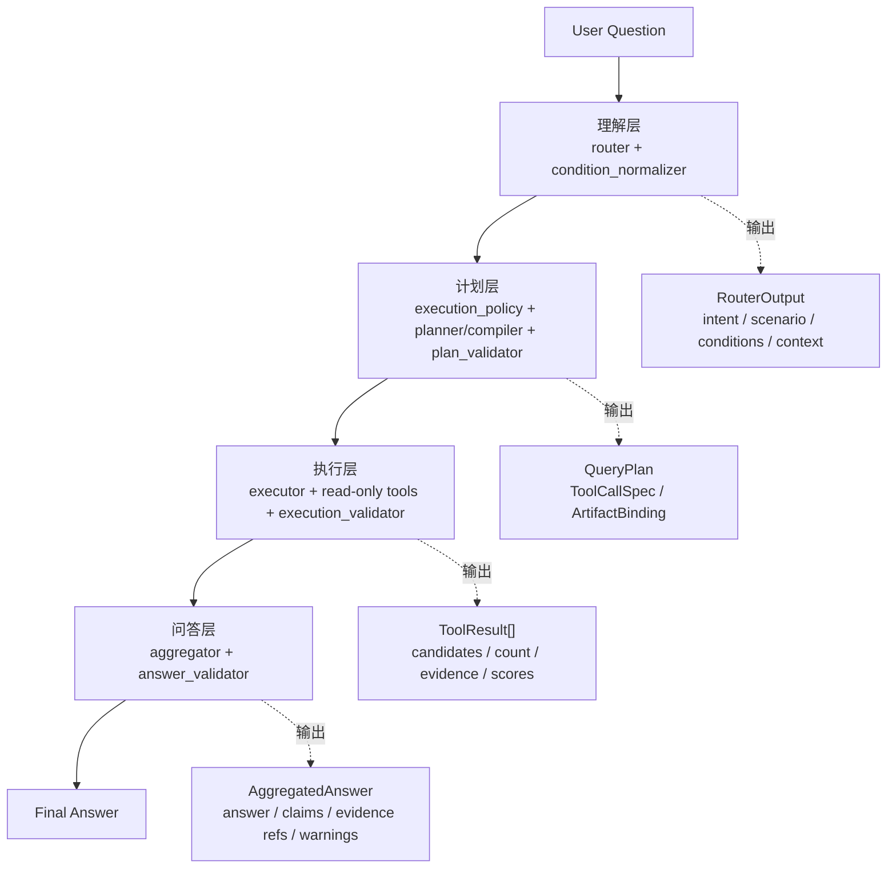

# Query-AI 面试讲解稿

这份文档是第一版面试讲法：目标是 8-10 分钟把项目讲清楚。

不要一上来铺完整 LangGraph，也不要先讲每个函数。先讲项目价值，再讲四层架构，
最后用一个例子走完主链。详细 graph 走读看 `ARCHITECTURE_GUIDE.md`，刁钻追问看
`INTERVIEW_QA_README.md`。

## 目录

1. 项目一句话
2. 项目目录和模块边界
3. 为什么不是普通 RAG
4. 四层架构图
5. 四层逐层讲解
6. 一个例子快速走完四层
7. 巧思点、作用点、收益点
8. 高频追问回答
9. 讲解顺序建议

## 1. 项目一句话

```text
Query-AI 是一个受约束、可追踪、可回归的智能简历问答系统。
它不是把简历问题直接丢给 LLM，而是把自然语言问题变成可验证的工具计划，
再基于只读工具事实生成经过校验的答案。
```

面试开场可以这样说：

```text
这个项目解决的是招聘场景里的简历问答。
用户可以问“金融候选人有几个，谁最强，依据是什么？”这类问题。
系统不会让 LLM 直接自由回答，而是先理解问题，再生成 QueryPlan，
再调用只读工具拿事实，最后由 aggregator 组织答案，并通过 validator 校验后返回。
```

一句话收束：

```text
重点不是接一个 RAG，而是把“问简历”做成可解释、可验证、可回归的工程链路。
```

## 2. 项目目录和模块边界

整个项目可以先按五块讲，不要一开始进入节点细节。

| 模块 | 负责什么 | 不做什么 |
| --- | --- | --- |
| `resume_query_v3/` | 简历入库、解析、chunk、embedding、写入 SQLite/Chroma。 | 不回答问题，不做 Query-AI 决策。 |
| `resume_query_tools/` | 只读查询数据底座，返回候选人、画像、证据等事实。 | 不规划工具链，不生成最终答案。 |
| `resume_query_ai_qa/` | Query-AI 主链：理解、规划、执行、校验、回答和 trace。 | 不绕过 tools 直接读写底层数据。 |
| `resume_query_api/` | HTTP API，调用 Query-AI graph，返回答案和诊断 trace。 | 不重新判断 intent，不修改答案事实。 |
| `resume_query_frontend_v3/` | 问答展示、候选人展示、Debug 面板。 | 不补事实，不重排结果。 |

面试讲法：

```text
数据底座由 resume_query_v3 准备；
事实查询能力由 resume_query_tools 提供；
Query-AI 负责把用户问题变成可执行、可校验的工具链；
API 和前端只负责调用和展示。
```

## 3. 为什么不是普通 RAG

普通 RAG 更像：

```text
query -> retrieve -> LLM summarize
```

这个项目更像：

```text
query -> RouterOutput -> QueryPlan -> ToolResult[] -> AggregatedAnswer -> validated answer
```

核心区别：

| 普通 RAG 风险 | Query-AI 的处理 |
| --- | --- |
| LLM 可能直接编答案。 | LLM 可以参与 draft 和表达，但最终事实来自 tools。 |
| 检索结果和问题意图耦合弱。 | router 先识别 intent、scenario、condition、context。 |
| 工具调用不可控。 | compiler 生成 `QueryPlan / ToolCallSpec`，validator 执行前检查。 |
| 答案容易改数量、排序、证据。 | answer_validator 检查 count、name、ranking、evidence、privacy、layout。 |
| 出错难排查。 | trace 记录 router、plan、tool results、validator issue 和 route。 |

面试里可以强调：

```text
这里不是自由 Agent。
LLM 不直接决定最终工具调用，也不是最终事实权威。
真正能执行的计划必须经过 compiler 和 validator；
真正能返回的答案必须经过工具事实和 answer_validator 收口。
```

## 4. 四层架构图

第一版讲解只抓四层：

```text
User Question
  -> 理解层 Query Understanding
  -> 计划层 Plan Building
  -> 执行层 Tool Execution
  -> 问答层 Answer Generation
  -> Final Answer
```



更准确地说：

```text
每层都有边界收口；
计划、执行、答案三层有 validator；
理解层主要靠 router guard、rule fallback、finalizer 和 condition normalizer 收口。
```

## 5. 四层逐层讲解

### 5.1 理解层

对应节点：

```text
router
condition_normalizer
```

解决什么问题：

```text
把自然语言问题压成结构化理解结果，让后续工具不用反复猜自然语言。
```

输入：

```text
用户问题
session_context
YAML 规则和 taxonomy
```

输出：

```text
RouterOutput
NormalizedCondition[]
```

这一层做什么：

- 判断用户意图：筛选、计数、排序、证据、画像、比较、out_of_scope。
- 判断是否复合问题：例如“有几个 + 谁最强 + 依据是什么”。
- 抽取并归一化条件：domain、skill、concept、major、candidate、scope。
- 识别上下文引用：例如“第一名”“这些人”“刚才那个人”。

巧思点：

- `router` 不查库、不调用工具、不回答问题，只做结构化理解。
- `condition_normalizer` 把别名收敛到标准 taxonomy，减少筛选漂移。
- 高风险字段会被 guard/finalizer 兜底，例如上下文引用和敏感面试问题。

收益：

- 后面 plan、tools、validator 都消费结构化字段。
- 降低自然语言歧义对工具参数的影响。
- 出错时可以定位是 intent 错、condition 错，还是 context 错。

#### Router 节点执行过程

router 可以讲成“LLM 先给语义草稿，规则负责硬护栏和合同收口”。

完整流程：

```text
preprocess_router_question
-> build_router_draft
-> apply_router_guards
-> complete_router_conditions
-> finalize_router_output
-> condition_normalizer
```

每一步的边界：

| 阶段 | 做什么 | 不做什么 |
| --- | --- | --- |
| preprocess | 统一标点、去掉开头口头词。 | 不判断 intent。 |
| build_router_draft | LLM 或 rule fallback 生成 RouterOutput 草稿。 | 不生成工具计划。 |
| apply_router_guards | 处理安全、上下文、明显错误等硬规则。 | 不用软业务规则抢 LLM 判断。 |
| complete_router_conditions | 补 LLM 漏掉的 raw condition。 | 不做参数编译。 |
| finalize_router_output | 让 intent/sub_intents/scenario/tools/requires 字段符合系统合同。 | 不因为“适合/推荐”这类软语义强制改 intent。 |
| condition_normalizer | 把 raw condition 归一成 taxonomy 条件，并标记 preference_target。 | 不改变 router 的 intent/scenario。 |

面试里可以这样收束：

```text
router 不追求一次性把自然语言判成唯一答案。
LLM 可以给 candidate_ranking，也可以给 candidate_filter；
router 只保证输出合法、上下文正确、字段自洽。
后面由 compiler 把当前 intent 翻译成可执行工具参数。
```

#### Router 三类规则

这次改造后，规则不再一股脑覆盖 LLM，而是分三类：

| 类型 | 是否覆盖 LLM | 例子 | 目的 |
| --- | --- | --- | --- |
| 硬规则 Hard Rule | 是 | out_of_scope、敏感问题、非法 scenario、明确上下文指代、候选人名误抽取、空工具调用风险。 | 保证安全、合法、可执行。 |
| 软提示 Soft Hint | 否 | “适合/推荐/匹配 X 岗位”倾向 ranking；“找找/相关/可能”倾向 open_recall。 | 给 trace 解释语义倾向。 |
| 诊断规则 Diagnostic | 否 | candidate_filter + preference_target；hard_filter 但普通 filter_args 为空。 | 提醒 compiler/validator 做场景化兜底。 |

关键原则：

```text
LLM 是语义 draft，不被软规则抢判断权。
硬规则只处理安全、合法性、上下文、明显错误和不可执行计划。
软提示和诊断规则只解释，不覆盖。
```

### 5.2 计划层

对应节点：

```text
execution_policy
planner
plan_compiler
plan_validator
plan_repair
```

解决什么问题：

```text
把结构化理解结果变成可执行、可验证的 QueryPlan。
```

输入：

```text
RouterOutput
NormalizedCondition[]
ExecutionDecision
session_context
compiler_templates.yaml
tool_policy.yaml
validation.yaml
```

输出：

```text
QueryPlan
ToolCallSpec[]
ArtifactBinding[]
ValidationResult
```

核心边界：

```text
planner = 生成 SemanticPlan / tool_hints，还不是可执行计划。
plan_compiler = 第一层允许生成 QueryPlan / ToolCallSpec。
plan_validator = 执行前检查 QueryPlan 是否合法。
```

两条计划路径：

```text
template:
router -> condition_normalizer -> execution_policy -> plan_compiler

generic:
router -> condition_normalizer -> execution_policy -> planner -> plan_compiler
```

巧思点：

- 高频稳定问题沉淀为 template，减少 LLM 不确定性。
- 开放问题可以让 planner 表达语义，但不能直接调用工具。
- compiler 负责生成计划，validator 负责只读检查，生成和校验分离。
- `ArtifactBinding` 让 count、rank、evidence 共享同一个候选池合同。

收益：

- 工具调用可审计、可校验、可复现。
- LLM 不能随便编工具名、参数或依赖。
- 新增稳定 workflow 可以优先改 YAML/template，而不是散落写 if。

### 5.3 执行层

对应节点：

```text
executor
tools
execution_validator
execution_repair
```

解决什么问题：

```text
按 QueryPlan 调用只读工具，并检查工具结果是否足够、自洽、安全。
```

输入：

```text
QueryPlan
ToolCallSpec[]
tool registry
session_context
```

输出：

```text
ToolResult[]
execution artifacts
ValidationResult
```

这一层原则：

```text
executor 不重新理解问题；
tools 不生成最终答案；
execution_validator 判断工具结果是否满足问题。
```

执行过程：

- executor 按 `ToolCallSpec.depends_on` 顺序执行工具。
- 工具结果保存到本轮 artifacts，例如 `candidate_pool`、`candidate_count`、`ranked_candidates`。
- 后续工具通过 `$ref` 或 `output_key` 消费前面工具结果。
- 工具异常不会直接打断整条 graph，而是包装成 `ToolResult`。

巧思点：

- tools 只读事实，不负责 route、repair 或自然语言回答。
- failure / empty result / business limit 被结构化成 validator issue。
- candidate lineage 检查防止“筛选出 A/B/C，排序冒出 D”。

收益：

- 工具失败可观测、可分类、可处理。
- 候选池、排序、证据链路保持一致。
- executor 简单稳定：只按计划执行，不重新做业务判断。

### 5.4 问答层

对应节点：

```text
aggregator
answer_validator
answer_rewrite
rule_answer_fallback
```

解决什么问题：

```text
把 ToolResult 事实组织成用户可读答案，并在出口前校验高风险事实。
```

输入：

```text
question
QueryPlan
ToolResult[]
answer_layouts.yaml
aggregator_tasks.yaml
evidence_policy.yaml
validation.yaml
```

输出：

```text
AggregatedAnswer
ValidationResult
Final Answer
```

aggregator 的真实模型：

```text
query + YAML 回答框架 + tool context + evidence -> AggregatedAnswer
```

LLM 可以做什么：

- 根据 question、layout、tool context、evidence 生成自然语言答案文本。
- 把工具事实组织成更清楚的表达。

LLM 不能做什么：

- 不能新增候选人。
- 不能改 count。
- 不能重排 ranking。
- 不能新增 evidence id。
- 不能泄露默认隐藏的联系方式或敏感属性。

关键收口：

```text
answer = LLM answer text 或 grounded fallback answer
claims = grounded claims
used_evidence_refs = grounded evidence refs
warnings = grounded warnings + LLM warnings
```

answer_validator 检查：

- 数量是否和 `count_candidates` 一致。
- 候选人名是否来自工具结果。
- 排序是否和 `rank_candidates` 一致。
- evidence id 是否真实存在。
- 是否泄露联系方式或敏感属性。
- layout 是否符合 YAML。
- 空证据时是否表达“未查到/不能确认”。

边界要主动讲清：

```text
当前不会逐句做自然语言蕴含校验。
它重点硬校验数量、候选人、排序、证据 id、隐私、layout 和空证据表达。
```

收益：

- 答案表达自然，但事实字段仍被工具结果约束。
- LLM 不可用或事实漂移时，可以退回 deterministic rule answer。
- 最终答案出口有明确检查点，不是 LLM 写完就返回。

## 6. 一个例子快速走完四层

示例问题：

```text
金融候选人有几个，谁最强，依据是什么？
```

### 理解层

`router` 识别这是复合问题：

```text
candidate_count
candidate_ranking
evidence_question
```

`condition_normalizer` 归一化条件：

```text
domain = 金融
```

这一层输出：

```text
RouterOutput
NormalizedCondition(domain=金融)
```

### 计划层

`execution_policy` 判断是否命中稳定 workflow。

`plan_compiler` 生成可执行 `QueryPlan`，大致包含：

```text
filter_candidates(domains_any=["金融"]) -> candidate_pool
count_candidates(candidate_pool) -> candidate_count
load_default_jd_criteria() -> criteria
score_candidates_for_jd(candidate_pool, criteria) -> scores
rank_candidates(scores) -> ranked_candidates
search_candidate_evidence(ranked_candidates) -> evidence_collection
```

`plan_validator` 检查：

```text
工具是否允许
参数是否完整
$ref 是否能绑定
count / rank / evidence 是否使用同一个 candidate_pool
```

这一层输出：

```text
QueryPlan
ToolCallSpec[]
ArtifactBinding[]
```

### 执行层

`executor` 按 `ToolCallSpec` 顺序调用只读 tools。

本轮 artifacts 类似：

```text
candidate_pool
candidate_count
criteria
scores
ranked_candidates
evidence_collection
```

`execution_validator` 检查：

```text
必需工具结果是否存在
count 是否能对上候选池
ranking 是否没有跑出候选池
evidence 是否属于对应候选人
```

这一层输出：

```text
ToolResult[]
validated execution
```

### 问答层

`aggregator` 基于：

```text
question
answer layout
candidate_count
ranked_candidates
evidence_collection
```

生成答案：

```text
金融候选人共有 N 位；
排名最强的是 X；
依据来自他的项目经历和证据片段；
如果证据不足，会明确说明未查到或不能确认。
```

`answer_validator` 最后检查：

```text
N 有没有写错
第一名有没有写错
候选人名字有没有幻觉
证据 id 是否真实
是否泄露隐私
layout 是否合规
```

最终返回：

```text
validated answer
trace
session_context update
```

## 6.1 一个排障 Case：适合后端开发岗位的候选人

这个 case 可以用来讲“为什么不是 AI 无法回答，而是 intent、condition、compiler 边界没有分清”。

问题：

```text
适合后端开发岗位的候选人
```

历史失败链路：

```text
router: candidate_filter
condition_normalizer: concept=后端开发，但标记为 preference_target
execution_policy: no stable workflow matched
plan_compiler: generic filter_candidates({})
plan_validator: 拦截空 filter
final_status: failed
```

真正根因：

```text
preference_target 在 filter 场景里被直接跳过，
导致 filter_args 为空，
generic compiler 生成了 filter_candidates({})。
```

同一个问题其实有多种合理解释：

```text
candidate_ranking:
  按后端开发岗位适配度排序推荐。

candidate_filter + hard_filter:
  找具备后端开发相关能力/经历的人。

candidate_filter + open_recall:
  语义召回和后端开发相关的人。
```

修复原则：

```text
不强制 router 一定判成 ranking。
LLM 可以保留语义自由度。
compiler 必须把同一个 preference_target 翻译成当前路径可执行参数。
```

现在的编译规则：

```text
candidate_ranking:
  preference_target=后端开发 -> target_role=后端开发

candidate_filter + hard_filter:
  preference_target concept=后端开发 -> concepts_all=["后端开发"]

candidate_filter + open_recall:
  preference_target=后端开发 -> query="后端开发 后端 backend"
```

trace 里会展示：

```text
hard_rules_applied
soft_hints
diagnostics
```

演讲时可以这样收束：

```text
我们没有用规则强行替代 LLM。
LLM 负责语义 draft，规则负责硬护栏，compiler 负责场景化翻译，validator 负责最后防线。
这样既保留 LLM 灵活性，又避免空工具调用这种不可执行计划。
```

## 7. 巧思点、作用点、收益点

| 设计点 | 作用 | 收益 |
| --- | --- | --- |
| 四层拆分 | 把理解、计划、执行、回答拆开。 | 出错能定位，不是一个大 prompt 黑盒。 |
| LLM draft + 规则收口 | LLM 负责开放理解和表达，规则负责边界。 | 兼顾灵活性和稳定性。 |
| QueryPlan | 把工具执行变成可审计计划。 | executor 不需要理解自然语言。 |
| ToolCallSpec | 明确单个工具的参数、依赖和输出。 | 工具调用可复现、可校验。 |
| ArtifactBinding | 描述产物来源、scope 和消费者。 | 保证 count/rank/evidence 用同一候选池。 |
| 只读 tools | 工具只返回事实，不下最终结论。 | 数据来源清楚，降低副作用。 |
| 三层 validator | plan、execution、answer 分层检查。 | 错误可分类，repair 有边界。 |
| YAML 合同 | intent、scenario、tool、validation、layout 配置化。 | 规则集中维护，适合回归测试。 |
| Trace / benchmark | 每轮运行可追踪，关键链路可回归。 | 能解释、能验收、能面试展示。 |

## 8. 高频追问回答

### LLM 和规则怎么分离？

LLM 主要做 draft：router draft、SemanticPlan/tool hints、答案文本。
规则负责把 draft 收口成合法 `RouterOutput`、`QueryPlan` 和 grounded answer。
最终能执行的工具调用和最终事实字段，都不是 LLM 自由输出直接决定的。

### 为什么 planner 和 compiler 分开？

planner 只表达语义步骤，还不是可执行计划。
compiler 才生成 `QueryPlan / ToolCallSpec`，并绑定参数、`$ref`、候选池和 artifact。
这样 LLM planner 不能越权决定最终工具调用。

### 既然 compiler 是程序，为什么还要 validator？

compiler 会消费 YAML、condition、context、artifact binding 和 tool metadata。
这些输入会变，组合也会变。
validator 是执行前只读闸门，防止配置错误、参数绑定错误、工具权限变化或复合 workflow 边界错误进入 executor。

### 为什么 tools 只读？

简历问答里最怕工具层顺手下结论或改数据。
只读 tools 保证事实来源清楚，答案生成和事实校验放在后面的 aggregator / validator。

### answer_validator 能完全防幻觉吗？

不能说完全逐句防幻觉。
它能稳定防住高风险事实：数量、候选人、排序、证据 id、隐私、layout 和空证据表达。
如果要进一步增强，可以单独加 `answer_text_grounding_validator`。

### out_of_scope 是不是 router 直接跳出？

不是。
router 只把问题标记成 `out_of_scope`，后续仍走统一 graph。
区别是后续必须生成 no-tools boundary answer：不查库、不调用简历工具、只返回边界回答。

更多追问看 `INTERVIEW_QA_README.md`。

## 9. 讲解顺序建议

8-10 分钟建议这样讲：

1. 先用一句话讲项目：可验证的智能简历问答系统。
2. 讲项目目录：入库、tools、Query-AI、API、前端。
3. 讲为什么不是普通 RAG。
4. 讲四层架构图。
5. 用“金融候选人有几个，谁最强，依据是什么？”快速走一遍四层。
6. 重点补计划层：planner / compiler / validator。
7. 讲三层 validator、只读 tools、trace 和 benchmark。
8. 最后讲边界：不是万能防幻觉，但能守住高风险事实。

如果面试官要看真实拓扑，再打开：

- [ARCHITECTURE_GUIDE.md](ARCHITECTURE_GUIDE.md)
- [INTERVIEW_QA_README.md](INTERVIEW_QA_README.md)
- [nodes/README.md](nodes/README.md)
- [graph/README.md](graph/README.md)
