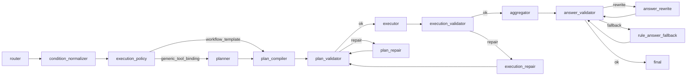

# resume_query_ai_qa

`resume_query_ai_qa` 是 Query-AI 主链实现层。它把自然语言问题变成可验证的
`QueryPlan`，调用只读 tools，并把工具事实组织成经过校验的答案。

它不负责简历入库、不写 SQLite/Chroma、不直接读取原始简历文件。

## Graph 主链



## 包职责

| 包 | 负责 | 边界 |
|---|---|---|
| `graph/` | 注册 LangGraph 节点、条件路由、run 入口。 | 不直接调 tools，不读数据底座。 |
| `nodes/` | 每个 graph node 的稳定包入口和节点内 helper。 | 不跨层改状态，不绕过 validator。 |
| `core/` | schema、config、纯规则、LLM 基础设施、answer generation。 | 不 import `nodes`、`graph`、`tools`。 |
| `tools/` | Query-AI 内部只读 tool wrapper 和 registry。 | 不生成最终答案。 |
| `scoring/` | JD 评分、候选人排序相关工具能力。 | 不参与 graph 路由。 |
| `state/` | session context 写回、trace event、state snapshot。 | 不做业务决策。 |
| `observability/` | 日志 sink、run summary、detail JSON。 | 不改变运行行为。 |
| `benchmarks/` | 合同测试和上线验收。 | 不承载生产逻辑。 |

## Template / Generic

`execution_policy` 会产出 `ExecutionDecision`：

```text
compiler = workflow_template | generic_tool_binding
planner = rule | llm
workflow_name = 命中的 workflow
scenarios = 每个 intent 的执行协议
```

`ExecutionDecision.scenarios` 来自 `RouterOutput.scenario_decisions`。`execution_policy`
只读取 router 已确定的 scenario，并据此选择 template/generic 与 workflow；它不重新解释
用户问题来判定 scenario。

两条路径：

```text
template:
router -> condition_normalizer -> execution_policy -> plan_compiler

generic:
router -> condition_normalizer -> execution_policy -> planner -> plan_compiler
```

template 用于稳定高频问题，例如候选人画像、固定 count/list、稳定复合 workflow。
generic 用于开放召回、未模板化问题或需要 planner 先描述语义步骤的问题。

## Scenario

`scenario` 表示本次 intent 应该如何执行，不是业务分类名。

| Scenario | 含义 | 典型问题 |
|---|---|---|
| `soft_summary` | 候选人画像展示。 | `介绍一下孟连星` |
| `hard_filter` | 结构化硬筛选。 | `金融领域候选人有哪些？` |
| `open_recall` | 开放语义召回。 | `可能的金融领域候选人` |
| `fact_check` | 明确候选人内查证据。 | `孙可欣有能源经历么` |
| `evidence_lookup` | 不限定候选人的证据查找。 | `谁做过风控项目` |
| `compare_rank` | 比较、排序、评分。 | `这些人里谁更适合金融岗位` |
| `out_of_scope` | 非简历问题。 | `今天天气怎么样` |

Scenario 由 router/finalizer 写入 `RouterOutput.scenario_decisions`，表示每个 intent
应该如何执行。LLM router 优先给出 scenario；如果 LLM 不可用、输出缺字段、
scenario 不符合 `scenarios.yaml` 允许关系，router 会整包回到 rule fallback。
finalizer 会保留合法 LLM scenario，并用 rule fallback 补齐缺失或被 guard 改动后的场景。
它会影响 workflow 命中、planner 是否运行、allowed tools、source contract、
evidence policy 和 validator 规则。

`execution_policy` 只消费 `RouterOutput.scenario_decisions`，不重新解释用户问题。
API `debug=true` 会返回 `trace.router_scenarios[]`，用于查看每个 scenario 的
`source`、`reason` 和 `evidence`。

## 配置入口

YAML 配置统一在 `resume_query_ai_qa/configs/`：

| 文件 | 作用 |
|---|---|
| `intents.yaml` | intent 定义、证据/JD 默认要求。 |
| `scenarios.yaml` | scenario 定义、allowed intents 和执行语义。 |
| `router_rules.yaml` | router guard、上下文、open recall 触发词。 |
| `../shared_taxonomy` | domain/concept/skill/major 的唯一共享 taxonomy；QA 代码通过 `core/rules/taxonomy.py` 访问。 |
| `condition_rules.yaml` | 条件类型、抽取、清洗和 preference target 规则。 |
| `compiler_templates.yaml` | 稳定 workflow template。 |
| `tool_policy.yaml` | generic compiler 工具白名单、推荐、禁止。 |
| `aggregator_tasks.yaml` | answer generation task 类型、选择规则和生成合同。 |
| `answer_layouts.yaml` | 答案结构、layout 和写作合同。 |
| `validation.yaml` | validator 边界配置。 |
| `evidence_policy.yaml` | 最小证据规则。 |
| `llm.yaml` | LLM provider/model。 |
| `jd_scoring.yaml` | JD scoring 配置；本轮架构审查不改造 `scoring/jd.py`。 |

## YAML 使用矩阵

| YAML | Runtime 消费方 | 共用规则边界 |
|---|---|---|
| `configs/intents.yaml` | router/finalizer、planner/compiler 默认 intent 语义、validator 合同。 | intent 名称和默认 evidence/JD 要求只能从这里进入 QA runtime。 |
| `configs/scenarios.yaml` | router/finalizer 写入 canonical scenario；execution_policy、compiler、validator 消费。 | `execution_policy` 只读取 `RouterOutput.scenario_decisions`，不重新判断 scenario。 |
| `configs/router_rules.yaml` | router guard、context resolver、open recall/sensitive/interview 信号。 | 不承载 domain/concept/skill canonical 别名；这些必须走 shared taxonomy。 |
| `configs/condition_rules.yaml` + `../shared_taxonomy/*` | condition_normalizer、candidate_mentions、tools/common、compiler query/filter args。 | domain/concept/skill/major 只能通过 `core/rules/taxonomy.py` 和 `condition_rules.py` 间接访问。 |
| `configs/compiler_templates.yaml` | execution_policy 命中 workflow，plan_compiler 编译 template，plan_validator 校验 source/artifact contract。 | 稳定 workflow 从这里沉淀，不在 compiler/validator 私有硬编码。 |
| `configs/tool_policy.yaml` | planner/compiler 工具白名单、推荐、禁止；validator 工具契约；execution_repair fallback_tool。 | tool allowed/preferred/forbidden、binding_kind、fallback_tool 都以这里为准。 |
| `configs/validation.yaml` | plan_validator、execution_validator、answer_validator、plan_repair、execution_repair、answer_rewrite。 | issue code、action、clarify/fail/repair 分类统一由 `core/rules/behavior_contract.py` 消费。 |
| `configs/evidence_policy.yaml` | execution_validator、answer_validator。 | 最小证据要求共用，不在 answer 层重新发明证据阈值。 |
| `configs/answer_layouts.yaml` + `configs/aggregator_tasks.yaml` | aggregator、answer_validator、answer_rewrite、rule_answer_fallback。 | 答案结构、task mode、layout contract 在配置和 `core/answer_generation/*` 共用。 |
| `configs/llm.yaml` | router、planner、plan_repair、aggregator、answer_rewrite 的 LLM 基础设施。 | provider/model/开关集中配置，节点只消费 LLM client。 |
| `configs/jd_scoring.yaml` | scoring/JD 能力。 | 本轮不审查、不改造 `resume_query_ai_qa/scoring/jd.py`。 |
| `benchmarks/benchmark_cases.yaml` | benchmarks。 | 测试用例，不是 runtime 规则。 |
| `resume_query_v3/configs/*.yaml` | v3 入库、解析、chunking、validate。 | 入库链路配置，不参与 Query-AI runtime 规则判断。 |

## 共用规则结论

- Router、execution_policy、compiler、validator 共用 `scenarios.yaml` 和 `RouterOutput.scenario_decisions`：router/finalizer 负责判断 scenario，后续节点只消费。
- Condition normalizer、candidate mentions、tools/common、compiler query/filter args 共用 `condition_rules.yaml` 和 `shared_taxonomy/*`：taxonomy 的唯一 QA 访问层是 `core/rules/taxonomy.py`。
- Planner、compiler、validator、execution_repair 共用 `tool_policy.yaml`：工具可用性、binding、fallback 不允许散落在节点私有表里。
- Plan validator、execution validator、answer validator、plan_repair、execution_repair 共用 `validation.yaml`：错误分类和 repair/fail/clarify action 统一由 `core/rules/behavior_contract.py` 承载。
- Execution validator 和 answer validator 共用 `evidence_policy.yaml`：证据覆盖规则不在答案层重复维护。
- Aggregator、answer_validator、answer_rewrite、rule_answer_fallback 共用 `answer_layouts.yaml`、`aggregator_tasks.yaml` 和 `core/answer_generation/*`。

Compiler、validator、repair 不是三套规则：

- `plan_compiler` 通过 `core/rules/plan_building.py`、`compiler_templates.yaml`、`tool_policy.yaml` 生成 `QueryPlan`。
- `plan_validator` 通过 `plan_structure`、`plan_boundaries`、`plan_artifacts`、`plan_semantics` 校验，并消费同一份 `tool_policy.yaml`、`compiler_templates.yaml`、`validation.yaml` 和 router-owned scenario。
- `plan_repair` 通过 `core/rules/behavior_contract.validation_action()` 和 `plan_building` 重建计划，修复后必须回到 `plan_validator` 复核。
- `execution_repair` 同样走 `validation_action()`，只在 `open_recall` 空检索时基于 `tool_policy.yaml.fallback_tool` 做受控 fallback。

结论：Compiler 负责生成，validator 负责只读校验，repair 负责按同一套
validation/tool/plan_building 规则修复；三者不是三套规则。

新增场景优先顺序：

1. 稳定高频问题先加 `compiler_templates.yaml`。
2. 开放问题先加 `tool_policy.yaml`，跑 generic，稳定后再沉淀 template。
3. 新工具必须先实现只读 tool、注册 registry，再加 policy 和 benchmark。
4. 新答案样式改 `answer_layouts.yaml`，不要在前端补事实。

## 可观测性

每次 run 都有 `trace_id`。默认 API 返回最小 `trace.diagnosis`；`debug=true`
返回完整 trace summary。

常用字段：

- `diagnosis.headline`：本轮可读诊断。
- `decision_steps[]`：每个 node 的 `status`、`summary`、error、warning。
- `route_events[]`：validator 路由到 execute、repair、fail、clarify、fallback 的原因。
- `validation_errors.plan/execution/answer`：三层 validator 错误。
- `log_file_hint`：detail JSON 定位提示。

日志操作手册见 [../QUERY_AI_LOGS.md](../QUERY_AI_LOGS.md)。

## 评估指标与后续量化方向

当前项目已经具备合同 benchmark、分层 validator 和 trace 日志，后续可以在
不改变主链路的情况下沉淀量化指标。

| 指标 | 含义 | 数据来源 |
|---|---|---|
| Router Accuracy | `intent`、`sub_intents`、`scenario_decisions` 是否符合 benchmark 期望。 | `benchmark_cases.yaml`、`trace.router_output`、policy benchmark |
| Plan Pass Rate | `QueryPlan` 是否一次通过 `plan_validator`。 | `trace.plan_validation_errors`、plan benchmark |
| Evidence Coverage Rate | evidence-required intent 是否拿到满足策略的 `EvidenceRef`；可区分真实证据命中和可回答空证据。 | `evidence_policy.yaml`、execution validator |
| Answer Validation Pass Rate | 答案是否通过事实、证据、排序、隐私和 layout 校验。 | `trace.answer_validation_errors`、runtime benchmark |
| Repair / Fail Rate | plan repair、execution repair、answer rewrite、fail 的触发比例。 | `trace.route_events[]` |

这些指标尚未做成独立 dashboard，但现有 trace 与 benchmark 已经提供统计基础。
项目当前优先完成的是工业化 Agent 主链路：LLM draft、规则收口、工具合同、
validator 防线、repair 闭环和可观测 trace。后续如果继续推进，可以先让
benchmark 输出 JSON report，再按 case family 统计 pass rate、repair rate 和
evidence coverage。

## 当前生产契约

- hard filter 空结果是事实答案，不扩大召回。
- open recall 空候选只允许受控 `query_fallback`。
- evidence tool 正常返回 0 条证据是 answerable，不进入检索回退。
- answer 必须说明“未查到/不能确认”，并记录 `empty_evidence:*` warning。
- out-of-scope 不执行简历 tools。
- 缺少所需上下文统一进入 `needs_clarification + required_context_missing`。

## 阅读顺序

1. 节点索引：[nodes/README.md](nodes/README.md)
2. Graph 编排：[graph/README.md](graph/README.md)
3. Trace 状态：[state/README.md](state/README.md)
4. 日志落盘：[observability/README.md](observability/README.md)
5. 部署验收：[benchmarks/DEPLOYMENT_ACCEPTANCE.md](benchmarks/DEPLOYMENT_ACCEPTANCE.md)
