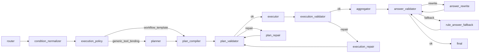

# Query-AI

`resume_query_ai_qa` 是简历问答系统的 Query-AI 主链。它把自然语言问题转换成
可验证的 `QueryPlan`，按计划调用只读 tools，再把工具事实组织成经过校验的答案。

一句话：

```text
自然语言简历问题 -> RouterOutput -> QueryPlan -> ToolResult[] -> AggregatedAnswer -> validated answer
```

它不是简历入库系统，也不是单纯 RAG。这个包的重点是把“问简历”做成可解释、
可校验、可回归的工程链路：LLM 可以参与理解和生成，但最终必须经过规则、
工具合同、validator 和 benchmark 约束。

## 本项目做什么

- 理解用户的简历相关问题，识别 intent、scenario、conditions 和上下文需求。
- 将问题编译成可执行、可验证的 `QueryPlan`。
- 通过只读 tools 查询候选人、画像、证据、评分和比较材料。
- 基于工具事实生成答案，并校验数量、候选人名、排序、证据引用、隐私和 layout。
- 记录 trace、route、repair/fallback 和运行日志，支持排查与回归。

## 本项目不做什么

- 不解析原始简历文件。
- 不负责简历入库、chunking、embedding 或索引构建。
- 不写 SQLite、Chroma 或候选人数据。
- 不绕过 `tools/` 直接读取底层数据。
- 不绕过 validator 直接把 LLM 输出交给用户。

## 主链路



白话讲：

- `router` 理解问题，但不查库、不回答。
- `condition_normalizer` 把条件标准化，比如 domain、skill、concept、candidate。
- `execution_policy` 决定走稳定 template，还是走 generic planner。
- `planner` / `plan_compiler` 生成 `QueryPlan` 和 `ToolCallSpec`。
- `plan_validator` 执行前检查计划是否合法。
- `executor` 只按计划调用只读 tools。
- `execution_validator` 检查工具结果是否满足合同。
- `aggregator` 基于工具事实组织答案。
- `answer_validator` 出口前校验最终答案。
- repair/fallback 只在受控边界内修复，不补造事实。

## 文件夹职责

| 目录 | 负责什么 | 不要放什么 |
| --- | --- | --- |
| `graph/` | LangGraph 编排、节点注册、条件路由、state 初始化、trace 收口。 | 不写 intent 判断、工具调用、答案生成等业务规则。 |
| `nodes/` | graph 节点入口；每个子目录对应一个阶段。 | 不跨层补事实，不绕过 validator，不直接操作数据底座。 |
| `core/` | schema、config facade、确定性规则、inspection、LLM client、answer generation。 | 不 import `nodes`、`graph`、`tools`。 |
| `tools/` | 只读工具 registry 和候选人、画像、证据、评分、比较查询能力。 | 不判断 intent，不选工具，不生成自然语言答案。 |
| `scoring/` | JD 标准、候选人评分、排序和评分理由。 | 不参与 graph 路由，不读取 graph state。 |
| `configs/` | YAML 规则真源：intent、scenario、tool policy、template、validation、layout、JD scoring。 | 不放 Python 执行逻辑。 |
| `benchmarks/` | policy、plan、runtime 等合同测试和上线验收。 | 不承载生产逻辑。 |
| `state/` | session context、trace event、state snapshot。 | 不做业务决策。 |
| `observability/` | run summary、detail JSON、日志 sink 和可观测性输出。 | 不改变运行行为。 |
| `scripts/` | 本地 CLI 和调试入口，如 `run_qa.py`、`query_logs.py`。 | 不作为 graph node，不替代 benchmark。 |
| `logs/` | 本地运行产物。 | 不作为源码逻辑或配置真源。 |

## 关键设计

### Template / Generic

Query-AI 有两条计划生成路径：

```text
template:
router -> condition_normalizer -> execution_policy -> plan_compiler

generic:
router -> condition_normalizer -> execution_policy -> planner -> plan_compiler
```

- 稳定高频问题走 `workflow_template`，例如固定候选人画像、count/list、稳定复合 workflow。
- 开放问题走 `generic_tool_binding`，由 planner 先描述语义步骤，再编译成工具计划。
- 两条路径最终都必须生成 `QueryPlan`，并通过 `plan_validator`。

### 三层 Validator

- `plan_validator`：执行前检查计划结构、工具权限、参数绑定和 source contract。
- `execution_validator`：执行后检查 `ToolResult[]` 是否满足结果合同、证据要求和空结果语义。
- `answer_validator`：出口前检查答案是否和工具事实一致，包含数量、候选人、排序、证据、隐私和 layout。

Validator 的意义是让系统可以使用 LLM，但不把 LLM 当最终权威。

### Repair / Fallback

- `plan_repair` 修复非法 `QueryPlan`，修完必须回到 `plan_validator`。
- `execution_repair` 只做受控执行后 fallback，例如 open recall 空结果时的安全回退。
- `answer_rewrite` 尝试重写答案，但仍必须回到 `answer_validator`。
- `rule_answer_fallback` 用确定性规则生成兜底答案。

Repair 和 fallback 都不能新增未经工具支持的事实。

### YAML 是规则真源

运行时规则优先沉淀在 `configs/`：

| YAML | 主要作用 |
| --- | --- |
| `intents.yaml` | intent 定义和默认证据/JD 要求。 |
| `scenarios.yaml` | scenario catalog 和 allowed intent 关系。 |
| `router_rules.yaml` | router fallback、guard、上下文和开放召回信号。 |
| `condition_rules.yaml` | condition 抽取、清洗、taxonomy 映射。 |
| `compiler_templates.yaml` | 稳定 workflow template。 |
| `tool_policy.yaml` | 工具白名单、推荐、禁止、binding kind 和 fallback tool。 |
| `validation.yaml` | validator、repair、retry 和 issue action。 |
| `evidence_policy.yaml` | 最小证据要求和空证据表达。 |
| `answer_layouts.yaml` | 答案结构和 layout contract。 |
| `aggregator_tasks.yaml` | answer task 类型和生成合同。 |
| `jd_scoring.yaml` | JD scoring 权重、默认标准路径和评分开关。 |
| `llm.yaml` | LLM provider、model、timeout 和 retry。 |

Python 负责执行算法和守边界；YAML 负责表达业务规则和合同。

### 只读 Tools

`tools/` 是 executor 真正调用的能力集合。上游决定“调用哪个工具、传什么参数”，
工具只读取事实材料并返回结构化结果。

工具可以返回候选人、画像、证据、评分、比较材料；不能生成最终自然语言答案，
也不能替 planner 决定工具链。

### Scoring / JD

`scoring/` 是确定性 JD 评分内核：

```text
configs/jd_scoring.yaml + scoring/JD.md + CandidateBrief + EvidenceRef[]
-> JDScoringCriteria
-> CandidateScore[]
```

`executor` 不直接调用 `scoring/jd.py`，而是通过 `tools/scoring_tools.py` adapter 使用评分能力。
默认岗位标准库位于 `resume_query_ai_qa/scoring/JD.md`。

## 开发注意事项

- 新增 intent：先改 `configs/intents.yaml`，再补 router/compiler/validator 需要的规则和 benchmark。
- 新增 scenario：先改 `configs/scenarios.yaml`，确认 allowed intents 和 execution semantics。
- 新增稳定 workflow：优先沉淀到 `configs/compiler_templates.yaml`。
- 新增工具：先实现只读 tool，再注册 `TOOL_REGISTRY`，再补 `tool_policy.yaml` 和 benchmark。
- 新答案样式：优先改 `answer_layouts.yaml` 和 renderer，不要在前端补事实。
- 调整证据口径：改 `evidence_policy.yaml`，不要在 answer 层重复维护阈值。
- 调整 JD 评分口径：改 `jd_scoring.yaml` 或 `scoring/JD.md`，不要让 aggregator 私自重排。
- `graph/` 只做编排，不写业务规则。
- `core/` 保持共享、稳定、低耦合，不反向依赖 graph/nodes/tools。
- `tools/` 保持只读，不做 route、repair 或自然语言生成。
- `推荐` 这类动作词只用于 router intent/ranking 语义，不应作为 taxonomy concept condition。

## 当前生产契约

- hard filter 空结果是事实答案，不扩大召回。
- open recall 空候选只允许受控 `query_fallback`。
- evidence tool 正常返回 0 条证据是 answerable，不进入检索回退。
- answer 必须说明“未查到/不能确认”，并记录空证据 warning。
- out-of-scope 不执行简历 tools。
- 缺少所需上下文统一进入 `needs_clarification`。

## 常用命令

本地跑一轮 Query-AI：

```bash
.venv/bin/python -m resume_query_ai_qa.scripts.run_qa "推荐运营领域的候选人" --no-llm --answer-only
.venv/bin/python -m resume_query_ai_qa.scripts.run_qa "谁最适合运营岗位？" --no-llm --answer-only
```

查看 trace：

```bash
.venv/bin/python -m resume_query_ai_qa.scripts.run_qa "推荐运营领域的候选人" --no-llm --show-trace
```

查看运行日志：

```bash
.venv/bin/python -m resume_query_ai_qa.scripts.query_logs list --limit 5
.venv/bin/python -m resume_query_ai_qa.scripts.query_logs failures --limit 5
```

合同回归：

```bash
.venv/bin/python resume_query_ai_qa/benchmarks/run_policy_contract_benchmark.py
.venv/bin/python resume_query_ai_qa/benchmarks/run_plan_contract_benchmark.py
.venv/bin/python resume_query_ai_qa/benchmarks/run_runtime_contract_benchmark.py
```

## 面试讲解重点

可以按这条线讲：

```text
用户问题不是直接进 LLM，而是先被 router 结构化；
结构化意图再被编译成 QueryPlan；
executor 只按 QueryPlan 调只读工具；
工具结果经过 execution validator；
答案由 aggregator 基于工具事实生成；
最终还要过 answer validator 才能返回。
```

亮点：

- 可控 Agent：LLM 是 draft，不是最终权威。
- 配置驱动：intent、scenario、tool policy、answer layout 尽量在 YAML 中表达。
- 三层防线：plan、execution、answer 都有 validator。
- 可回归：benchmark 覆盖 policy、plan、runtime 行为。
- 可观测：trace 和 logs 能解释每一步为什么这么走。

一句话收束：

```text
这个项目的重点不是把 LLM 接上去，而是把“问简历”拆成可解释、可验证、可回归的工程链路。
```

## 阅读顺序

1. 节点索引：[nodes/README.md](nodes/README.md)
2. Graph 编排：[graph/README.md](graph/README.md)
3. 核心规则：[core/README.md](core/README.md)
4. 只读工具：[tools/README.md](tools/README.md)
5. YAML 配置：[configs/README.md](configs/README.md)
6. JD 评分：[scoring/README.md](scoring/README.md)
7. Trace 状态：[state/README.md](state/README.md)
8. 日志落盘：[observability/README.md](observability/README.md)
9. 本地脚本：[scripts/README.md](scripts/README.md)
10. 合同测试：[benchmarks/README.md](benchmarks/README.md)
11. 面试疑问速查：[INTERVIEW_QA_README.md](INTERVIEW_QA_README.md)
