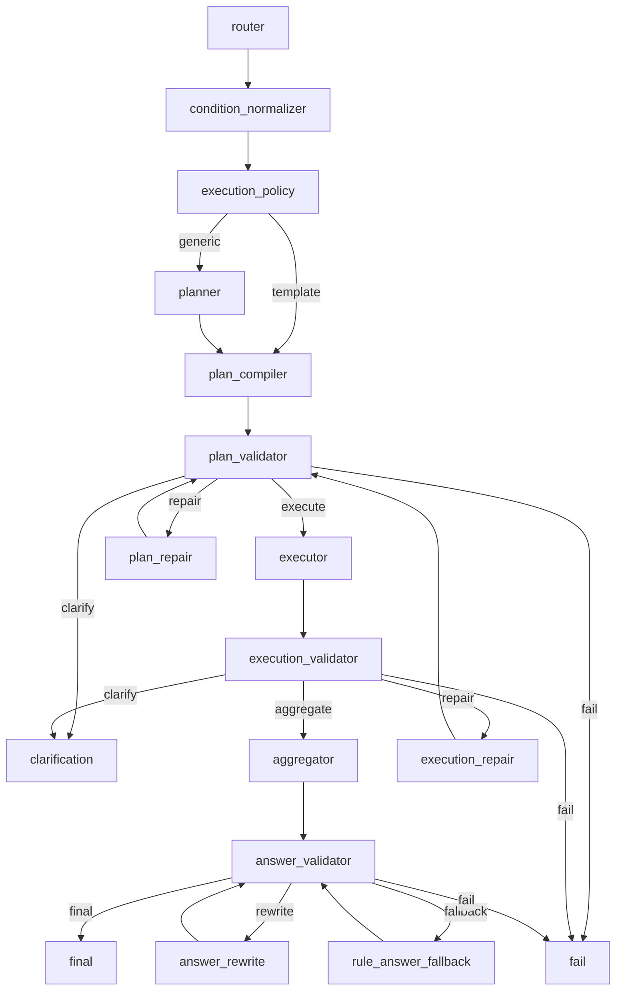

# Graph Package

## 一句话

`resume_query_ai_qa/graph/` 负责把所有 node 串成一次完整 Query-AI 运行。

```text
graph = 编排层
nodes = 业务节点入口
core/rules/config = 业务规则和 YAML 合同
tools = 只读工具执行
```

Graph 只负责：

```text
初始化运行
注册 LangGraph 节点和边
把 graph state 传给 nodes/*
根据 validator/policy 结果选择下一跳
记录 trace / route / debug 摘要
收口 final / clarification / fail
```

Graph 不负责：

```text
不判断 intent
不抽 conditions
不生成 QueryPlan
不调用具体工具函数
不判断工具结果是否足够
不生成最终答案内容
不解释 YAML 业务字段
```

## 文件阅读顺序

```text
1. README.md
2. GRAPH_FLOW.md
3. runner.py
4. state.py
5. build.py
6. routes.py
7. nodes.py
8. query_nodes.py
9. planning_nodes.py
10. execution_nodes.py
11. answer_nodes.py
12. terminal_nodes.py
13. trace_logging.py
14. utils.py
```

## 文件职责

| 文件 | 职责 | 不做什么 |
| --- | --- | --- |
| `runner.py` | public `run()` 入口，加载 config，初始化 state，执行 graph，持久化 trace。 | 不做节点业务判断。 |
| `state.py` | 定义 `_GraphState` 和初始 state。 | 不做 route 判断。 |
| `build.py` | 注册 LangGraph 节点、普通边和条件边。 | 不决定条件边结果。 |
| `routes.py` | 根据 state 和 classify/policy 结果选择下一跳并记录 route。 | 不修复、不执行、不重新理解问题。 |
| `nodes.py` | 兼容 facade，re-export 拆分后的 graph adapters。 | 不放具体 adapter 实现。 |
| `query_nodes.py` | router / condition_normalizer / execution_policy adapter。 | 不实现 query 理解规则。 |
| `planning_nodes.py` | planner / plan_compiler / plan_validator / plan_repair adapter。 | 不实现 planning/repair 规则。 |
| `execution_nodes.py` | executor / execution_validator / execution_repair adapter。 | 不实现工具函数。 |
| `answer_nodes.py` | aggregator / answer_validator / answer_rewrite / rule_answer_fallback adapter。 | 不新增答案事实。 |
| `terminal_nodes.py` | final / clarification / fail terminal adapter。 | 不继续业务链路。 |
| `trace_logging.py` | graph-local trace 摘要、debug payload、plan/answer summary。 | 不做业务决策。 |
| `utils.py` | graph 小工具：计时、require_plan、context scope、preview。 | 不做 node 业务逻辑。 |

## Graph 拓扑



## 核心 State 流转

| 字段 | 谁写入 | 谁读取 | 含义 |
| --- | --- | --- | --- |
| `qa` | `build_initial_state`，所有 adapter 更新 | 所有 graph 节点 | 本轮运行主状态和 trace 容器。 |
| `config` | `runner.run` | 所有 adapter / route | 已加载 YAML 配置对象。 |
| `use_llm` | `runner.run` | router/planner/aggregator/rewrite | 是否允许 LLM 路径。 |
| `router_output` | `router_node` / `condition_normalizer_node` | policy/planner/compiler/validator/repair | 路由意图、条件、上下文和 scenario。 |
| `execution_decision` | `execution_policy_node` | routes/planner/compiler/aggregator | template/generic、workflow、scenario 决策。 |
| `semantic_plan` | `planner_node` 或 compiler fallback | `plan_compiler_node` | generic 路径语义计划。 |
| `qa.plan` | `plan_compiler_node` / repair nodes | validator/executor/answer | 可执行 QueryPlan。 |
| `qa.tool_results` | `executor_node` | execution_validator/aggregator/answer_validator | 工具事实结果。 |
| `qa.answer` | aggregator/rewrite/fallback/clarification | answer_validator/final/API | 当前答案对象。 |
| `current_plan_errors/issues` | `plan_validator_node` | `routes.py` / plan_repair / clarification | 当前 plan validation 问题。 |
| `current_execution_errors/issues` | `execution_validator_node` | `routes.py` / execution_repair / clarification | 当前执行结果问题。 |
| `current_answer_errors/issues` | `answer_validator_node` | `routes.py` / answer_rewrite / clarification | 当前答案问题。 |
| `plan_repairs` | `plan_repair_node` | `routes.py` | 已做 plan repair 次数。 |
| `execution_repairs` | `execution_repair_node` | `routes.py` | 已做 execution repair 次数。 |
| `answer_rewrites` | `answer_rewrite_node` / fallback | `routes.py` | 已做 answer rewrite/fallback 次数。 |
| `answer_fallback_requested` | `answer_rewrite_node` | `routes.py` | 是否请求 rule_answer_fallback。 |
| `final_status` | terminal nodes | runner | `ok` / `needs_clarification` / `failed`。 |

## Route 判断来源

Graph 的 route 只做“下一跳选择”，不重新做业务判断。

### execution_policy 后

```text
route_after_execution_policy_node
-> route_after_execution_policy(decision)
-> decision.compiler
```

判断来源：

```text
ExecutionDecision.compiler
```

下游：

```text
template -> plan_compiler
generic  -> planner
```

### plan_validator 后

```text
route_after_plan_validation
```

判断顺序：

```text
plan_validation_ok
-> classify_plan_repair_action(...)
-> plan_repairs < max_plan_repairs
```

下游：

```text
execute / repair / clarify / fail
```

### execution_validator 后

```text
route_after_execution_validation
```

判断顺序：

```text
execution_validation_ok
-> classify_execution_repair_action(...)
-> execution_repairs < max_execution_repairs
```

下游：

```text
aggregate / repair / clarify / fail
```

### answer_validator 后

```text
route_after_answer_validation
```

判断顺序：

```text
answer_validation_ok
-> answer_fallback_requested
-> answer_rewrites < max_answer_rewrites
-> answer_rewrites == max_answer_rewrites
```

下游：

```text
final / rewrite / fallback / fail
```

## YAML 使用边界

Graph 只加载并传递 `ResumeQAConfig`，几乎不直接解释 YAML 业务字段。

| YAML | Graph 层关系 | 真正解释者 |
| --- | --- | --- |
| `validation.yaml.retry_limits` | runner 有默认 retry 参数；graph state 保存 `max_*`。 | runner/API 调用方、config model、routes state。 |
| `validation.yaml.issue_actions` | routes 调用 classify 函数，自己不读 issue_actions。 | plan_repair / execution_repair / behavior_contract。 |
| `compiler_templates.yaml` | graph 不读，只按 `ExecutionDecision.compiler` 路由。 | execution_policy / plan_compiler。 |
| `tool_policy.yaml` | graph 不读。 | planner / compiler / validators / repair。 |
| `answer_layouts.yaml` | graph 不读，只记录 meta。 | aggregator / answer_validator / answer_rewrite。 |
| `evidence_policy.yaml` | graph 不读。 | execution_validator / answer_validator。 |

通俗讲：

```text
Graph 看 node 的结果，不直接看 YAML 规则。
```

## 各阶段 Adapter 总结

### query_nodes.py

包含：

```text
router_node
condition_normalizer_node
execution_policy_node
```

职责：

```text
把用户问题变成 RouterOutput 和 ExecutionDecision。
```

注意：

```text
router 是否用 LLM 由 use_llm + is_llm_enabled(config) 决定。
condition_normalizer 会覆盖 state.router_output。
execution_policy 只写 decision，route 在 routes.py。
```

### planning_nodes.py

包含：

```text
planner_node
plan_compiler_node
plan_validator_node
plan_repair_node
```

职责：

```text
生成 SemanticPlan / QueryPlan，校验计划，并在可修复时重建计划。
```

注意：

```text
plan_compiler_node 会 record_plan，把 QueryPlan 写入 qa.plan。
plan_repair_node 修完仍回 plan_validator。
```

### execution_nodes.py

包含：

```text
executor_node
execution_validator_node
execution_repair_node
```

职责：

```text
执行工具、校验工具结果、修复安全的执行后 fallback。
```

注意：

```text
executor 失败会包装成 ToolResult，不直接中断 graph。
execution_repair 修完回 plan_validator，不直接回 executor。
```

### answer_nodes.py

包含：

```text
aggregator_node
answer_validator_node
answer_rewrite_node
rule_answer_fallback_node
```

职责：

```text
基于工具事实生成答案、校验答案、重写或规则兜底。
```

注意：

```text
answer_rewrite/fallback 后都回 answer_validator。
answer_fallback_requested 是 routes.py 进入 rule_answer_fallback 的信号。
```

### terminal_nodes.py

包含：

```text
final_node
clarification_node
fail_node
```

职责：

```text
收口运行状态，写 final_status，准备终端输出。
```

注意：

```text
terminal 节点不继续调用业务节点。
```

## 阅读入口

详细流转看：

```text
GRAPH_FLOW.md
```

节点业务细节看：

```text
resume_query_ai_qa/nodes/README.md
resume_query_ai_qa/nodes/NODES_FLOW.md
```

## 验收

```bash
rg "Graph Package|GRAPH_FLOW|runner.run|build_state_graph|route_after_answer_validation|router_node|answer_rewrite_node" resume_query_ai_qa/graph
./.venv/bin/python -m compileall -q resume_query_ai_qa/graph
./.venv/bin/python resume_query_ai_qa/benchmarks/run_policy_contract_benchmark.py
./.venv/bin/python resume_query_ai_qa/benchmarks/run_plan_contract_benchmark.py
./.venv/bin/python resume_query_ai_qa/benchmarks/run_runtime_contract_benchmark.py
./.venv/bin/python resume_query_ai_qa/benchmarks/run_architecture_contract_benchmark.py
```
