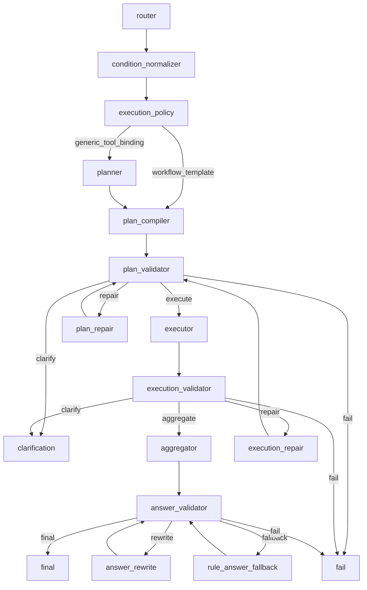

# Query-AI Nodes

`resume_query_ai_qa/nodes/` 是 Query-AI graph 节点的稳定入口目录。

一句话：

```text
nodes = 把用户问题一步步变成可验证工具计划、工具结果和最终答案
```

节点只做自己的层级职责：不跨层补事实、不绕过 validator、不直接操作数据底座。

## 总心智模型

```text
router               = 自然语言 -> 结构化意图
condition_normalizer = raw conditions -> normalized_conditions
execution_policy     = 决定 template 还是 generic
planner              = generic 路径生成 SemanticPlan
plan_compiler        = SemanticPlan/workflow -> QueryPlan/ToolCallSpec
plan_validator       = 执行前合同检查
plan_repair          = 修复非法 QueryPlan，修完回 validator
executor             = 按 QueryPlan 调用只读工具
execution_validator  = 执行后检查 ToolResult[]
execution_repair     = 修复安全的执行后空结果 fallback
aggregator           = query + YAML 框架 + ToolResult 事实 -> AggregatedAnswer
answer_validator     = 最终答案出口前校验
answer_rewrite       = 生成 rewrite candidate 或请求 rule fallback
rule_answer_fallback = 确定性规则答案兜底
clarification        = 生成澄清问题
session_context      = 终端上下文辅助
```

## Graph 地图



主成功路径：

```text
router
-> condition_normalizer
-> execution_policy
-> planner? / plan_compiler
-> plan_validator
-> executor
-> execution_validator
-> aggregator
-> answer_validator
-> final
```

## 节点总览

### router

职责：

```text
把用户问题收敛成 RouterOutput：intent、sub_intents、scenario、conditions、context、requires flags。
```

不做：

```text
不查库，不调用工具，不生成 QueryPlan，不回答用户。
```

联动：

```text
上游 user question/session context
下游 condition_normalizer、execution_policy、planner、compiler、validator
```

主要 YAML：

```text
intents.yaml
scenarios.yaml
router_rules.yaml
condition_rules.yaml
tool_policy.yaml
```

注意点：

```text
LLM/rule draft 不是最终权威；guard 和 finalizer 会收口。
normalized_conditions 不在 router 生成。
```

文档：

```text
router/README.md
router/ROUTER_FLOW.md
router/YAML_USAGE.md
```

### condition_normalizer

职责：

```text
把 RouterOutput.conditions 归一化成 normalized_conditions。
```

不做：

```text
不改 intent，不改 scenario，不选工具，不调用工具。
```

联动：

```text
上游 router
下游 execution_policy、planner、plan_compiler、plan_validator
```

主要 YAML：

```text
condition_rules.yaml
shared_taxonomy/
```

注意点：

```text
domain/skill/concept/major/scope 走 taxonomy/rules。
candidate_name 不走 taxonomy，来自候选人识别和数据层。
```

文档：

```text
condition_normalizer/README.md
condition_normalizer/CONDITION_FLOW.md
condition_normalizer/YAML_USAGE.md
```

### execution_policy

职责：

```text
根据 RouterOutput 和 normalized_conditions 判断走 workflow_template 还是 generic_tool_binding。
```

不做：

```text
不生成 SemanticPlan，不生成 QueryPlan，不拼工具参数。
```

联动：

```text
上游 condition_normalizer
下游 template 路径到 plan_compiler，generic 路径到 planner
```

主要 YAML：

```text
compiler_templates.yaml.workflows
scenarios.yaml
.env compiler flags
```

注意点：

```text
workflow 匹配主要看 intent、scenario、requires_scope 等合同字段。
```

文档：

```text
execution_policy/README.md
execution_policy/EXECUTION_FLOW.md
execution_policy/YAML_USAGE.md
```

### planner

职责：

```text
generic 路径里，把 RouterOutput + ExecutionDecision 收敛成 SemanticPlan。
```

不做：

```text
不生成 ToolCallSpec，不拼 $ref，不调用工具。
```

联动：

```text
上游 execution_policy
下游 plan_compiler
```

主要 YAML：

```text
intents.yaml.semantic_needs
intents.yaml.scenario_optional_needs
intents.yaml.scenario_defaults
tool_policy.yaml tool hints
scenarios.yaml planner
```

注意点：

```text
planner 产出语义步骤，不是可执行计划。
template 路径会跳过 planner。
```

文档：

```text
planner/README.md
planner/PLANNER_FLOW.md
planner/YAML_USAGE.md
```

### plan_compiler

职责：

```text
把 SemanticPlan 或 workflow template 编译成 QueryPlan / ToolCallSpec。
```

不做：

```text
不执行工具，不修 plan，不回答用户，不私自扩大候选范围。
```

联动：

```text
上游 planner 或 execution_policy template path
下游 plan_validator
```

主要 YAML：

```text
compiler_templates.yaml
tool_policy.yaml
intents.yaml scenario defaults
.env compiler flags
```

注意点：

```text
这是第一层允许创建 ToolCallSpec 的节点。
$binding 和 filter_args 会在这里绑定成工具参数。
```

文档：

```text
plan_compiler/README.md
plan_compiler/PLAN_COMPILER_FLOW.md
plan_compiler/YAML_USAGE.md
```

### plan_validator

职责：

```text
执行前检查 QueryPlan 是否可安全交给 executor。
```

不做：

```text
不生成 plan，不修 plan，不调用工具。
```

联动：

```text
上游 plan_compiler / plan_repair
下游 executor / plan_repair / clarification / fail
```

主要 YAML：

```text
tool_policy.yaml
scenarios.yaml
compiler_templates.yaml artifact_contracts
validation.yaml
```

注意点：

```text
它是只读闸门；非法 plan 必须交给 plan_repair 或终止路径。
```

文档：

```text
plan_validator/README.md
plan_validator/PLAN_VALIDATOR_FLOW.md
plan_validator/YAML_USAGE.md
```

### plan_repair

职责：

```text
修复 plan_validator 判定为可修复的非法 QueryPlan，修完回 plan_validator。
```

不做：

```text
不调用工具，不直接进入 executor，不放宽 tool policy。
```

联动：

```text
上游 plan_validator
下游 plan_validator
```

主要 YAML：

```text
validation.yaml.issue_actions
validation.yaml.plan_repair
tool_policy.yaml
tool registry
```

注意点：

```text
默认是基于 RouterOutput 做确定性重建，不是在坏 plan 上随意 patch。
```

文档：

```text
plan_repair/README.md
plan_repair/PLAN_REPAIR_FLOW.md
plan_repair/YAML_USAGE.md
```

### executor

职责：

```text
按已经验证的 QueryPlan 顺序调用只读工具，返回 ToolResult[]。
```

不做：

```text
不生成工具调用，不修 plan，不判断结果是否足够回答。
```

联动：

```text
上游 plan_validator
下游 execution_validator
```

主要 YAML：

```text
validation.yaml.retry_limits.executor_tool_call
```

注意点：

```text
前面工具输出放入 tool_context，后面工具通过 $ref 读取。
工具异常不直接打断全链路，而是包装成 failed ToolResult。
```

文档：

```text
executor/README.md
executor/EXECUTOR_FLOW.md
executor/YAML_USAGE.md
```

### execution_validator

职责：

```text
执行后检查 ToolResult[] 是否满足 QueryPlan / RouterOutput。
```

不做：

```text
不调用工具，不修 plan，不生成答案。
```

联动：

```text
上游 executor
下游 aggregator / execution_repair / clarification / fail
```

主要 YAML：

```text
tool_policy.yaml business_limits / intent_result_requirements
evidence_policy.yaml
validation.yaml
```

注意点：

```text
检查 failed tool、必需结果、证据覆盖、count/compare 一致性、candidate lineage。
```

文档：

```text
execution_validator/README.md
execution_validator/EXECUTION_VALIDATOR_FLOW.md
execution_validator/YAML_USAGE.md
```

### execution_repair

职责：

```text
只修 open_recall + empty_retrieval + fallback_tool 这类安全执行后 fallback。
```

不做：

```text
不修 hard_filter 空结果，不修 evidence 空结果，不绕过 plan_validator。
```

联动：

```text
上游 execution_validator
下游 plan_validator
```

主要 YAML：

```text
validation.yaml.issue_actions
tool_policy.yaml.tools.*.fallback_tool
condition_rules.yaml query cleaning
```

注意点：

```text
repair 后回 plan_validator，再重新 executor。
```

文档：

```text
execution_repair/README.md
execution_repair/EXECUTION_REPAIR_FLOW.md
execution_repair/YAML_USAGE.md
```

### aggregator

职责：

```text
把 question + YAML 回答框架 + ToolResult 事实 + evidence 组织成 AggregatedAnswer。
```

不做：

```text
不调用工具，不查库，不重新规划，不改变工具事实。
```

联动：

```text
上游 execution_validator
下游 answer_validator
```

主要 YAML：

```text
aggregator_tasks.yaml
answer_layouts.yaml
validation.yaml.answer
evidence_policy.yaml
```

注意点：

```text
render_grounded_answer 每次都会先生成。
LLM 可以生成 answer 文本，但 claims / used_evidence_refs 由 grounded 收口。
```

文档：

```text
aggregator/README.md
aggregator/AGGREGATOR_FLOW.md
aggregator/YAML_USAGE.md
```

### answer_validator

职责：

```text
最终答案出口前校验 AggregatedAnswer。
```

不做：

```text
不重写答案，不调用工具，不逐句核验 LLM 文本全部事实。
```

联动：

```text
上游 aggregator / answer_rewrite / rule_answer_fallback
下游 final / answer_rewrite / rule_answer_fallback / fail
```

主要 YAML：

```text
validation.yaml.answer
validation.yaml.privacy
answer_layouts.yaml
evidence_policy.yaml
```

注意点：

```text
它校验 grounded claims + 部分 final answer 文本。
count/ranking/layout/privacy/evidence refs 是重点。
```

文档：

```text
answer_validator/README.md
answer_validator/ANSWER_VALIDATOR_FLOW.md
answer_validator/YAML_USAGE.md
```

### answer_rewrite

职责：

```text
在 answer_validator 报错后，生成 rewrite candidate 或请求 rule_answer_fallback。
```

不做：

```text
不直接放行答案，不调用工具，不新增事实，不改 QueryPlan。
```

联动：

```text
上游 answer_validator
下游 answer_validator / rule_answer_fallback
```

主要 YAML：

```text
validation.yaml.answer_repair.rule_repair_categories
answer_layouts.yaml
aggregator_tasks.yaml
```

注意点：

```text
rule_repair 在本节点里表现为 fallback_request，不是在本节点内部直接重建答案。
rewrite 后必须回 answer_validator。
```

文档：

```text
answer_rewrite/README.md
answer_rewrite/ANSWER_REWRITE_FLOW.md
answer_rewrite/YAML_USAGE.md
```

### rule_answer_fallback

职责：

```text
LLM 答案或 rewrite 无法通过时，用确定性规则重新生成 AggregatedAnswer。
```

不做：

```text
不重新检索，不重新规划，不改变人数/名单/排名/证据。
```

联动：

```text
上游 answer_validator / answer_rewrite route
下游 answer_validator
```

主要 YAML：

```text
answer_layouts.yaml
aggregator_tasks.yaml
evidence_policy.yaml
```

注意点：

```text
生成后仍必须回 answer_validator 复检。
```

文档：

```text
rule_answer_fallback/README.md
```

### clarification

职责：

```text
把可澄清的缺失上下文或候选人选择问题转换成用户可回答的问题。
```

不做：

```text
不调用工具，不生成业务答案，不修 plan/result/answer。
```

联动：

```text
上游 plan_validator / execution_validator
下游 END
```

主要 YAML：

```text
validation.yaml.clarification
```

注意点：

```text
主要服务 context_missing、comparison_cardinality 等需要用户补信息的场景。
```

文档：

```text
clarification/README.md
```

### session_context / final / fail 辅助

职责：

```text
为 final、clarification、failed 等终端输出准备上下文写回和展示安全元数据。
```

不做：

```text
不规划，不执行工具，不修复业务链路，不生成业务答案。
```

联动：

```text
final_node / clarification_node / fail_node
```

主要 YAML：

```text
少量读取 validation / display 相关配置；主要依赖 graph state 和 public data access。
```

注意点：

```text
这里是终端辅助包，不是业务问答节点。
```

文档：

```text
session_context/README.md
```

## 统一边界

| 层级 | 允许做 | 不允许做 |
| --- | --- | --- |
| Router / Normalizer | 理解问题和条件 | 调工具、查库、回答 |
| Policy / Planner / Compiler | 选择执行路径、生成计划 | 执行工具、生成答案 |
| Validators | 只读检查合同 | 修复、执行、回答 |
| Repair | 只修可修复问题，修完回 validator | 绕过 validator |
| Executor | 执行已验证工具计划 | 改 plan、判断答案质量 |
| Aggregator / Answer | 基于工具事实组织答案 | 新增工具事实 |
| Terminal helpers | 写回上下文、解释状态 | 补业务事实 |

## YAML 使用总图

| 配置 | 主要消费者 | 用途 |
| --- | --- | --- |
| `intents.yaml` | router / planner / finalizer | intent、semantic needs、requires flags。 |
| `scenarios.yaml` | router / execution_policy / validator | scenario 合同和 allowed intents。 |
| `router_rules.yaml` | router guard/rules | rule fallback、compound、context、risk flags。 |
| `condition_rules.yaml` | router / condition_normalizer / plan_building | 条件抽取、taxonomy、preference target、query cleaning。 |
| `compiler_templates.yaml` | execution_policy / plan_compiler / validator | workflow 匹配、template tool calls、artifact contracts。 |
| `tool_policy.yaml` | planner / compiler / validators / repair | allowed tools、preferred tools、fallback tool、business limits。 |
| `validation.yaml` | validators / repair / graph route | issue actions、retry limits、answer/privacy 校验。 |
| `evidence_policy.yaml` | execution_validator / answer_validator / aggregator | 证据覆盖、空证据表达和隐私约束。 |
| `aggregator_tasks.yaml` | aggregator / answer_rewrite / fallback | task type、generation contract、回答任务框架。 |
| `answer_layouts.yaml` | aggregator / answer_validator / rewrite / fallback | layout、标题、章节和 claim contract。 |

## 排查入口

```text
intent / scenario 错      -> router
condition 错              -> condition_normalizer
workflow 路由错           -> execution_policy
SemanticPlan 错           -> planner
ToolCallSpec 参数错       -> plan_compiler
plan validation 错        -> plan_validator
plan repair 异常          -> plan_repair
$ref / tool 调用错        -> executor
ToolResult 不满足问题     -> execution_validator
open recall 空召回修复错  -> execution_repair
答案组织/框架错           -> aggregator
答案事实/隐私/layout 错   -> answer_validator
rewrite/fallback 错       -> answer_rewrite / rule_answer_fallback
上下文缺失提示错          -> clarification / session_context
```

## 阅读顺序

从全局读：

```text
README.md
NODES_FLOW.md
graph/build.py
graph/nodes.py
graph/routes.py
```

再按节点读：

```text
router
condition_normalizer
execution_policy
planner
plan_compiler
plan_validator
plan_repair
executor
execution_validator
execution_repair
aggregator
answer_validator
answer_rewrite
rule_answer_fallback
clarification
session_context
```

每个已整理节点优先按：

```text
README.md -> *_FLOW.md -> YAML_USAGE.md -> py files
```

详细阅读线见 `NODES_FLOW.md`。

## 验收

```bash
rg "Query-AI Nodes|NODES_FLOW|router|answer_rewrite|rule_answer_fallback|YAML" resume_query_ai_qa/nodes/README.md resume_query_ai_qa/nodes/NODES_FLOW.md
./.venv/bin/python -m compileall -q resume_query_ai_qa/nodes
./.venv/bin/python resume_query_ai_qa/benchmarks/run_policy_contract_benchmark.py
./.venv/bin/python resume_query_ai_qa/benchmarks/run_plan_contract_benchmark.py
./.venv/bin/python resume_query_ai_qa/benchmarks/run_runtime_contract_benchmark.py
```
