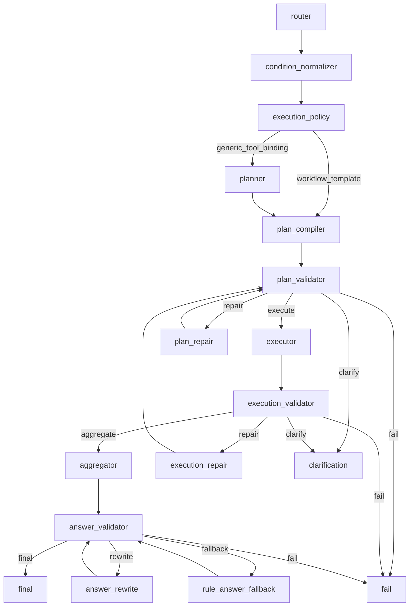

# Query-AI Nodes

`resume_query_ai_qa/nodes/` 存放 graph 中每个节点的稳定包入口和节点内 helper。
这里是排查 Query-AI 主链的第一张地图。

节点只做自己的职责：不跨层补事实、不绕过 validator、不直接操作数据底座。

## 节点地图



主链：

```text
router
-> condition_normalizer
-> execution_policy
   -> template: plan_compiler
   -> generic: planner -> plan_compiler
-> plan_validator
-> executor
-> execution_validator
-> aggregator
-> answer_validator
-> final
```

## 节点职责速查

| Node | 输入 | 输出 | 成功条件 | 失败/诊断字段 | 下游 | 说明 |
|---|---|---|---|---|---|---|
| `router` | question、session context | `RouterOutput` draft | intent/scenario/context/conditions 初步稳定 | `fallback_reason`、risk flags | `condition_normalizer` | [router](router/README.md) |
| `condition_normalizer` | `RouterOutput.conditions` | `normalized_conditions` | 条件被标准化并可被下游消费 | `warnings` | `execution_policy` | [condition_normalizer](condition_normalizer/README.md) |
| `execution_policy` | question、normalized RouterOutput | `ExecutionDecision` | template/generic 明确，并携带 router-owned scenario | `route_events.reason` | `planner` 或 `plan_compiler` | [execution_policy](execution_policy/README.md) |
| `planner` | question、RouterOutput、ExecutionDecision | `SemanticPlan` | generic 语义步骤稳定 | `fallback_reason` | `plan_compiler` | [planner](planner/README.md) |
| `plan_compiler` | `SemanticPlan` 或 workflow | `QueryPlan`、artifact bindings | tool calls、refs、scope 清晰 | rejected tool hints | `plan_validator` | [plan_compiler](plan_compiler/README.md) |
| `plan_validator` | `QueryPlan`、RouterOutput、context | `ValidationResult` | plan 合法可执行 | `errors`、`warnings`、`route_events` | `executor` / `plan_repair` / `fail` | [plan_validator](plan_validator/README.md) |
| `plan_repair` | invalid `QueryPlan`、plan errors | repaired `QueryPlan` | 修复后仍需 validator 复核 | `repair_action`、`repair_reason`、`error_category` | `plan_validator` | [plan_repair](plan_repair/README.md) |
| `executor` | validated `QueryPlan` | `ToolResult[]` | 工具按依赖顺序执行并包装结果 | tool `error`、`warnings` | `execution_validator` | [executor](executor/README.md) |
| `execution_validator` | `QueryPlan`、`ToolResult[]` | `ValidationResult` | 工具结果满足契约或可回答 | `errors`、`warnings`、`route_events` | `aggregator` / `execution_repair` / `fail` | [execution_validator](execution_validator/README.md) |
| `execution_repair` | execution errors、plan、tool results | repaired `QueryPlan` | 只做受控 fallback | `repair_action`、`repair_reason`、`error_category` | `plan_validator` | [execution_repair](execution_repair/README.md) |
| `aggregator` | question、plan、tool results | `AggregatedAnswer` | 答案只表达工具事实 | `warnings`、`fallback_reason` | `answer_validator` | [aggregator](aggregator/README.md) |
| `answer_validator` | answer、tool results、plan | `ValidationResult` | claim、证据、layout 一致 | `errors`、`warnings`、`route_events` | `final` / `answer_rewrite` / `fail` | [answer_validator](answer_validator/README.md) |
| `answer_rewrite` | invalid answer、answer errors | repaired answer | 重写后仍需 validator 复核 | `fallback_reason`、`repair_action` | `answer_validator` | [answer_rewrite](answer_rewrite/README.md) |
| `session_context` | final/clarification 辅助数据 | updated context/options | 上下文写回可用于下一轮 | context delta | terminal | [session_context](session_context/README.md) |

## 失败字段速查

| 字段 | 产生位置 | 含义 |
|---|---|---|
| `errors` | validator / node output | 当前节点发现的阻塞错误。 |
| `warnings` | validator / aggregator / tools | 可解释但不阻塞的问题，例如 `empty_evidence:*`。 |
| `fallback_reason` | LLM 或 answer 相关节点 | LLM 不可用、输出漂移、schema 失败等回退原因。 |
| `repair_action` | `plan_repair`、`execution_repair` | 实际修复动作，例如 `query_fallback`。 |
| `repair_reason` | repair 节点 | 为什么允许修复。 |
| `error_category` | repair 分类 | 错误类别，例如 `binding`、`context_missing`、`empty_evidence`。 |
| `route_events[].reason` | graph routes | 条件边为什么去 execute、repair、fail、clarify 或 fallback。 |
| `diagnosis.headline` | API summary | 前端状态卡展示的人类可读主结论。 |

## 统一节点 README 模板

每个节点子目录 README 必须回答：

```text
职责
输入
输出
主流程
失败 / Repair / Fallback
Trace 字段
边界：能做 / 不能做
扩展方式
验收 benchmark
```

写 README 时以真实代码为准，不写尚未实现的理想架构。

## 如何审查一个 Node

1. 从 graph 确认上游、下游和 conditional edge。
2. 列出它消费和写回的 state 字段。
3. 判断它是否越界：是否选了不该选的工具、改了不该改的事实、绕过 validator。
4. 看 trace：`decision_steps[].summary`、`errors`、`warnings`、`route_events`。
5. 跑最小相关 benchmark，再跑 boundary contract。

## 节点不得自维护规则

节点只能消费 `core/config.py`、`core/rules/*`、registry、schema 提供的共享规则。
新增规则先沉淀到公共配置或 `core/rules`，再由节点调用。

| 规则类型 | 唯一入口 | 节点边界 |
|---|---|---|
| intent / scenario / context | router/finalizer + `intents.yaml` + `scenarios.yaml` + `router_rules.yaml` | router 负责判断；execution_policy、compiler、validator 只消费 router-owned scenario。 |
| domain / concept / skill / major taxonomy | `core/rules/taxonomy.py` + `condition_rules.py` | node/tool 不直接读 `shared_taxonomy` YAML，不维护私有 alias 表。 |
| tool policy / binding / fallback | `tool_policy.yaml` + registry + `core/rules/plan_building.py` | compiler、validator、repair 不维护私有工具白名单、禁止表或 fallback 表。 |
| validation issue/action | `validation.yaml` + `core/rules/behavior_contract.py` | validator 和 repair 共用错误分类、repair/fail/clarify action。 |
| evidence policy | `evidence_policy.yaml` + `core/rules/evidence_policy.py` | execution_validator 和 answer_validator 共用证据要求。 |
| answer layout/task | `answer_layouts.yaml` + `aggregator_tasks.yaml` + `core/answer_generation/*` | aggregator、answer_validator、rewrite/fallback 不私有定义答案结构。 |

Compiler、validator、repair 的分工是同一套规则下的不同阶段：`plan_compiler`
生成 `QueryPlan`，`plan_validator` 只读校验，`plan_repair`/`execution_repair`
按共享 validation/tool/plan_building 规则修复，并把修复后的 plan 送回 validator。

## 扩展原则

- 新 intent：先从 router/rules 和 benchmark 开始。
- 新 scenario：先在 router/finalizer 规则和 `scenarios.yaml` 定义执行语义，再更新 tool policy 和 validator。
- 新 workflow：先加 `compiler_templates.yaml`，再补 compiler/validator benchmark。
- 新 tool：先只读实现并注册 registry，再开放给 compiler policy。
- 新答案样式：先改 `answer_layouts.yaml`，再补 answer validator/aggregator benchmark。

## 逐节点索引

| 子目录 | 何时阅读 |
|---|---|
| [router](router/README.md) | intent、scenario、compound、上下文、out-of-scope 判断异常。 |
| [condition_normalizer](condition_normalizer/README.md) | domain/skill/concept 条件标准化异常。 |
| [execution_policy](execution_policy/README.md) | template/generic 调度异常，或 router-owned scenario 未被正确消费。 |
| [planner](planner/README.md) | generic SemanticPlan、LLM fallback、tool hint 异常。 |
| [plan_compiler](plan_compiler/README.md) | QueryPlan、ToolCallSpec、artifact binding 异常。 |
| [plan_validator](plan_validator/README.md) | plan validation error、source contract、context 缺失。 |
| [plan_repair](plan_repair/README.md) | plan repair 行为和失败原因。 |
| [executor](executor/README.md) | 工具调用、`$ref` 绑定、ToolResult 包装。 |
| [execution_validator](execution_validator/README.md) | 工具结果不足、空结果、lineage、count mismatch。 |
| [execution_repair](execution_repair/README.md) | open recall 空候选 query fallback。 |
| [aggregator](aggregator/README.md) | 答案组织、layout、empty evidence warning。 |
| [answer_validator](answer_validator/README.md) | 答案 claim、证据、数量、隐私校验。 |
| [answer_rewrite](answer_rewrite/README.md) | answer rewrite 和 rule fallback。 |
| [session_context](session_context/README.md) | final/clarification 上下文写回和候选人选项。 |
