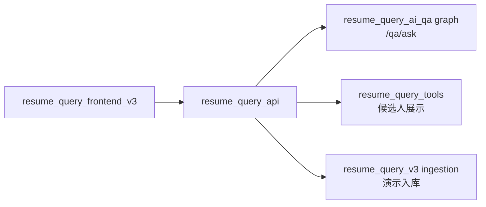
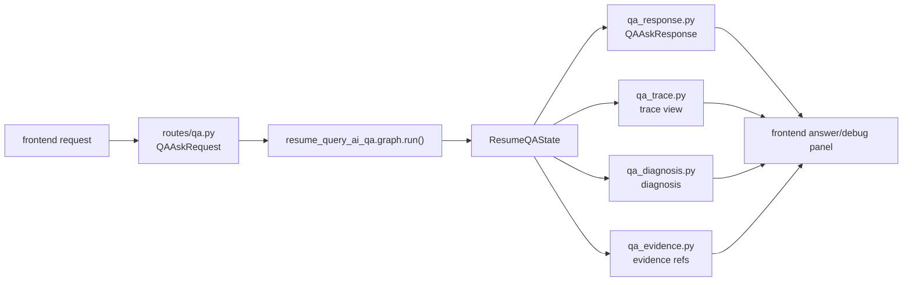

# resume_query_api

`resume_query_api` 是 HTTP 薄 API + 前端 DTO / debug view 装配层。

它负责接住前端请求，把 Query-AI 问答请求交给 `resume_query_ai_qa.graph.run()`，
把候选人展示请求交给只读 tools，并把返回结果整理成前端可直接展示的 JSON。

它不判断业务 intent，不生成 `QueryPlan`，不修正答案事实，不直接读写
SQLite / Chroma。Graph node 的职责边界以
`resume_query_ai_qa/nodes/README.md` 为准；API 层只读 `ResumeQAState`
并做 response / trace / diagnosis 投影。

## 责任边界

| 负责 | 不负责 |
|---|---|
| HTTP request/response schema。 | 判断用户真实意图。 |
| 调用 `resume_query_ai_qa.graph.run()`。 | 生成或修复 `QueryPlan`。 |
| 调用只读展示接口。 | 绕过 tools 直接查库。 |
| 装配前端 DTO、最小 trace 和 debug trace。 | 修正答案数量、名单、排序或证据。 |
| 暴露 demo ingestion 入口。 | 把 ingestion 当作 Query-AI 主链能力。 |

## 总链路位置



## 主要接口

| 接口 | 作用 |
|---|---|
| `GET /health` | SQL / Chroma 健康检查。 |
| `GET /llm/status` | LLM provider 可用性检查。 |
| `POST /qa/ask` | Query-AI 问答主入口。 |
| `GET /candidates` | 候选人列表。 |
| `GET /candidates/{resume_identity}` | 候选人详情。 |
| `GET /candidates/{resume_identity}/projects` | 候选人项目。 |
| `GET /candidates/{resume_identity}/resume-document` | 候选人简历文件状态。 |
| `POST /candidates/{resume_identity}/summary` | 候选人展示页总结。 |
| `POST /ingestion/resumes` | 批量扫描 `resume/` 的演示入库入口。 |
| `POST /ingestion/resumes/upload` | 上传单份简历到 `resume/uploads/` 并入库。 |
| `GET /ingestion/status` | 演示入库进度。 |

## API Flow 解读顺序

读 `/qa/ask` 这一层时，按这个顺序看：

```text
main.py
-> routes/qa.py
-> qa_schemas.py
-> qa_response.py
-> qa_trace.py
-> qa_diagnosis.py
-> qa_evidence.py
-> qa_utils.py
```

| 文件 | 看什么 |
|---|---|
| `main.py` | FastAPI app 创建、CORS、router 注册。 |
| `routes/qa.py` | `POST /qa/ask` 薄入口：校验空问题、调用 graph、返回 response。 |
| `qa_schemas.py` | `QAAskRequest` / `QAAskResponse` 的外部 JSON 合同。 |
| `qa_response.py` | `ResumeQAState -> QAAskResponse`，包括 answer、ranking、comparison。 |
| `qa_trace.py` | public/debug trace、node details、trace graph、compiler decision。 |
| `qa_diagnosis.py` | 面向前端诊断卡的人类可读 diagnosis。 |
| `qa_evidence.py` | 展示用 evidence refs 提取、去重和缺省 summary。 |
| `qa_utils.py` | API view 层共享的纯工具函数。 |

候选人展示和 demo ingestion 分别看：

```text
routes/candidates.py
routes/health.py
routes/ingestion.py
```

## `/qa/ask` 数据流



成功路径里，API 层只做投影：

```text
question/session_context/use_llm/debug
-> graph.run(...)
-> ResumeQAState
-> answer + trace + ranking + evidence + updated_session_context
-> QAAskResponse
```

空问题会在 `routes/qa.py` 返回 400；业务澄清、失败和 fallback 由 graph state
表达，API 不重新判断。

## `/qa/ask` Trace

默认响应返回最小 trace：

```text
trace_id
intent
final_status
clarification_required
```

`debug=true` 时额外返回：

```text
diagnosis
decision_steps
node_details
route_events
tools
validation_errors
retry_count
router_scenarios
semantic_plan
execution_decision
compiled_plan
compiler_decision
session_context_snapshot
graph
log_file_hint
```

排查顺序：

1. 看 `trace.diagnosis.headline`，确认本轮主结论。
2. 看 `trace.route_events`，确认 validator 路由到了 execute、repair、fail、clarify 还是 fallback。
3. 看 `trace.validation_errors.plan/execution/answer`，定位失败层。
4. Debug 开启后，用 `trace.diagnosis.trace_lookup` 或 `trace.log_file_hint` 找 detail JSON。

核心字段：

| 字段 | 含义 |
|---|---|
| `diagnosis.level` | `ok/info/warning/clarification/error`，前端诊断卡颜色来源。 |
| `diagnosis.headline` | 人类可读摘要，例如失败原因、空证据 warning、fallback 提示。 |
| `diagnosis.failed_node` | 最后一个明确失败或带错误类别的节点。 |
| `diagnosis.failed_reason` | route reason、validator error、tool error 中优先级最高的一条。 |
| `diagnosis.fallbacks` | 发生过 fallback/repair 的节点、动作和原因。 |
| `diagnosis.warnings` | 可解释 warning，例如 `empty_evidence:*`。 |
| `decision_steps[].status` | 单个 node 的状态。 |
| `decision_steps[].summary` | 单个 node 的短摘要。 |
| `route_events[].reason` | graph 条件路由原因。 |

失败字段词典：

| 字段 | 来源 | 解释 |
|---|---|---|
| `plan_validation_errors` | `plan_validator` | `QueryPlan` 结构、工具、scope、context 不合法。 |
| `execution_validation_errors` | `execution_validator` | 工具结果不满足执行契约或 lineage 逃逸。 |
| `answer_validation_errors` | `answer_validator` | 答案不被工具事实支撑。 |
| `fallback_reason` | LLM / answer / planner 节点 | LLM 不可用、输出漂移或 schema 失败导致回退。 |
| `repair_action` | repair 节点 | 实际执行的修复动作，例如 `query_fallback`。 |
| `repair_reason` | repair 节点 | 为什么允许修复。 |
| `error_category` | repair / route 分类 | 失败类别，例如 `binding`、`context_missing`、`empty_evidence`。 |
| `empty_evidence:*` | answer warnings | 证据工具正常返回 0 条；不是系统失败。 |

完整日志在：

```text
resume_query_ai_qa/logs/<timestamp>_<trace_id>.json
```

## 排查入口

| 现象 | 先看哪里 |
|---|---|
| `/qa/ask` 字段缺失、trace shape 不对 | `qa_schemas.py`、`qa_response.py`、`qa_trace.py`。 |
| diagnosis 文案、level、suggested check 不对 | `qa_diagnosis.py`。 |
| evidence refs 展示重复、summary 不好读 | `qa_evidence.py`。 |
| intent、scenario、node 路由不对 | `resume_query_ai_qa/graph` 和 `resume_query_ai_qa/nodes`。 |
| 工具事实、候选人、证据内容不对 | `resume_query_tools`。 |
| 前端展示布局或 Debug 面板不对 | `resume_query_frontend_v3`。 |
| ingestion、文件预览、下载问题 | `routes/ingestion.py`、`routes/candidates.py`。 |

## Demo 边界

`POST /ingestion/resumes`、文件预览和下载是演示 / 调试入口。生产化前需要补鉴权、
目录白名单、路径 containment、日志脱敏和保留策略。

## 启动

```bash
./.venv/bin/uvicorn resume_query_api.main:app --host 127.0.0.1 --port 8000
```

健康检查：

```text
http://127.0.0.1:8000/health
```

## 检查

```bash
rg "API Flow|qa_response|qa_trace|qa_diagnosis|ResumeQAState|POST /qa/ask" resume_query_api/README.md
.venv/bin/python -m compileall -q resume_query_api
```
