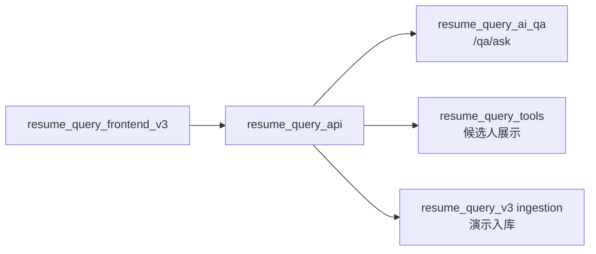

# resume_query_api

`resume_query_api` 是 HTTP 薄 API 层。它把前端请求交给 Query-AI graph 或只读
tools，并把结果整理成前端可展示的 DTO。

它不判断业务 intent，不编译 QueryPlan，不修改答案事实，不直接读写 SQLite/Chroma。

## 责任边界

| 负责 | 不负责 |
|---|---|
| HTTP request/response schema。 | 判断用户真实意图。 |
| 调用 `resume_query_ai_qa.graph.run()`。 | 生成工具计划。 |
| 调用只读展示接口。 | 绕过 tools 直接查库。 |
| 返回最小 diagnosis 和 Debug trace。 | 修正答案数量、名单、排序或证据。 |
| 暴露 demo ingestion 入口。 | 把 ingestion 当作 Query-AI 主链能力。 |

## 总链路位置



## 主要接口

| 接口 | 作用 |
|---|---|
| `GET /health` | SQL/Chroma 健康检查。 |
| `POST /qa/ask` | Query-AI 问答主入口。 |
| `GET /candidates` | 候选人列表。 |
| `GET /candidates/{resume_identity}` | 候选人详情。 |
| `GET /candidates/{resume_identity}/projects` | 候选人项目。 |
| `POST /candidates/{resume_identity}/summary` | 候选人展示页总结。 |
| `POST /ingestion/resumes` | 演示入库入口。 |

## `/qa/ask` Trace

默认响应会返回最小 trace：

```text
trace_id
intent
final_status
clarification_required
diagnosis
```

`debug=true` 时额外返回：

```text
decision_steps
route_events
tools
validation_errors
retry_count
router_scenarios
semantic_plan
execution_decision
compiled_plan
compiler_decision
session_context_snapshot
graph
log_file_hint
```

排查顺序：

1. 看 `trace.diagnosis.headline`，确认本轮主结论。
2. 看 `trace.route_events`，确认 validator 路由到了 execute、repair、fail、clarify 还是 fallback。
3. 看 `trace.validation_errors.plan/execution/answer`，定位失败层。
4. Debug 开启后，用 `trace.diagnosis.trace_lookup` 或 `trace.log_file_hint` 找 detail JSON。

核心字段：

| 字段 | 含义 |
|---|---|
| `diagnosis.level` | `ok/info/warning/clarification/error`，前端诊断卡颜色来源。 |
| `diagnosis.headline` | 人类可读摘要，例如失败原因、空证据 warning、fallback 提示。 |
| `diagnosis.failed_node` | 最后一个明确失败或带错误类别的节点。 |
| `diagnosis.failed_reason` | route reason、validator error、tool error 中优先级最高的一条。 |
| `diagnosis.fallbacks` | 发生过 fallback/repair 的节点、动作和原因。 |
| `diagnosis.warnings` | 可解释 warning，例如 `empty_evidence:*`。 |
| `decision_steps[].status` | 单个 node 的状态。 |
| `decision_steps[].summary` | 单个 node 的短摘要。 |
| `route_events[].reason` | graph 条件路由原因。 |

失败字段词典：

| 字段 | 来源 | 解释 |
|---|---|---|
| `plan_validation_errors` | `plan_validator` | QueryPlan 结构、工具、scope、context 不合法。 |
| `execution_validation_errors` | `execution_validator` | 工具结果不满足执行契约或 lineage 逃逸。 |
| `answer_validation_errors` | `answer_validator` | 答案不被工具事实支撑。 |
| `fallback_reason` | LLM/answer/planner 节点 | LLM 不可用、输出漂移或 schema 失败导致回退。 |
| `repair_action` | repair 节点 | 实际执行的修复动作，例如 `query_fallback`。 |
| `repair_reason` | repair 节点 | 为什么允许修复。 |
| `error_category` | repair/route 分类 | 失败类别，例如 `binding`、`context_missing`、`empty_evidence`。 |
| `empty_evidence:*` | answer warnings | 证据工具正常返回 0 条；不是系统失败。 |

完整日志在：

```text
resume_query_ai_qa/logs/<timestamp>_<trace_id>.json
```

## Demo 边界

`POST /ingestion/resumes`、文件预览和下载是演示/调试入口。生产化前需要补鉴权、
目录白名单、路径 containment、日志脱敏和保留策略。

## 启动

```bash
./.venv/bin/uvicorn resume_query_api.main:app --host 127.0.0.1 --port 8000
```

健康检查：

```text
http://127.0.0.1:8000/health
```

## 检查

```bash
.venv/bin/python -m compileall -q resume_query_api
```
