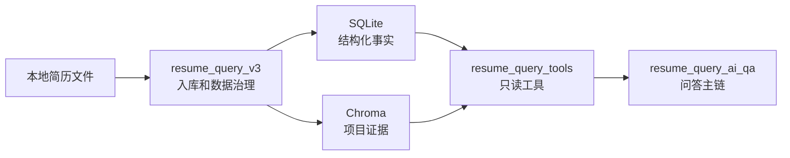
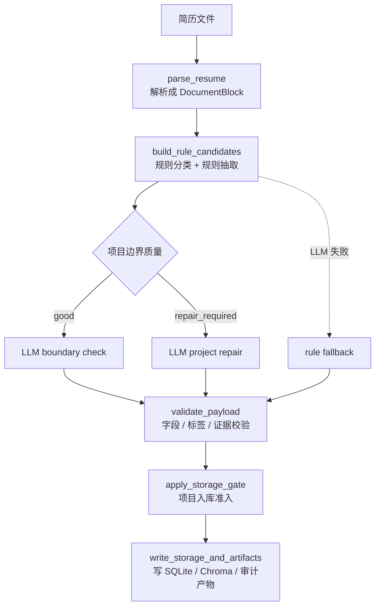

# resume_query_v3 面试讲解稿

这份文档是 `resume_query_v3` 的面试讲法。它不是完整源码手册，而是用来讲清：

```text
v3 在整体架构里的位置；
入库链路怎么走；
LLM 在哪里用；
validate 和 storage gate 分别守什么；
为什么这样设计。
```

## 1. 一句话定位

```text
resume_query_v3 是系统的数据基座。
它不负责回答问题，而是把本地简历解析成可信、可追溯、可校验的数据，
写入 SQLite 和 Chroma，再交给 resume_query_tools 和 Query-AI 使用。
```

面试开场可以这样讲：

```text
Query-AI 后面再会规划、再会组织答案，也必须建立在准确数据上。
所以 v3 的目标不是“聪明回答”，而是先把简历事实做准：
候选人是谁、有哪些经历、项目边界在哪里、证据来自哪一段、最后写到了哪里。
```

## 2. 在整体架构中的位置



讲法：

```text
resume_query_v3 负责把原始简历变成数据底座；
SQLite 存候选人、经历、标签、项目 manifest 等结构化事实；
Chroma 存项目级证据向量；
resume_query_tools 只读这些数据；
resume_query_ai_qa 不直接读入库 pipeline，只通过 tools 拿事实。
```

一句话：

```text
v3 负责把数据做准，Query-AI 负责基于可信数据回答问题。
```

## 3. 入库主链路图



主链路可以按 6 步讲：

```text
parse_resume
-> build_rule_candidates
-> resolve_with_llm_or_rule_fallback
-> validate_payload
-> apply_storage_gate
-> write_storage_and_artifacts
```

## 4. 关键节点讲解

### parse_resume

做什么：

```text
把 PDF / DOCX / TXT 简历解析成 DocumentBlock[]。
```

每个 block 保留：

```text
block_id
page
text
source_path
```

为什么这么做：

```text
后面的字段、标签、项目、证据都要能追溯到原始简历段落。
如果一开始只拿纯文本，没有 block_id 和 page，后面就很难解释“依据来自哪里”。
```

### build_rule_candidates

这一步是规则驱动，不是 LLM。

它做：

```text
文档分类
block 动作判断
字段抽取
经历抽取
标签抽取
项目候选块抽取
项目边界质量评估
```

其中 block 动作包括：

```text
keep
hard_drop
soft_downgrade
llm_review
```

可以这样理解：

```text
keep = 保留高价值 block
hard_drop = 丢掉明显噪音，例如扫码、公众号、重复联系方式
soft_downgrade = 降权低信息内容，例如“性格开朗、沟通能力强”
llm_review = 内容相关但结构暧昧，后续可给 LLM 看
```

为什么这么做：

```text
不能把整份简历直接丢给 LLM。
简历可能很长、格式混乱、重复块多，所以先用规则做分类、过滤和候选抽取。
```

### resolve_with_llm_or_rule_fallback

这一步只在项目边界上使用 LLM。

```text
项目边界正常 -> LLM boundary check
项目边界异常 -> LLM project repair
LLM 失败 -> rule fallback
```

什么叫项目边界：

```text
一个项目从哪里开始，到哪里结束。
```

为什么需要修复项目边界：

```text
简历里的项目经历经常和工作职责、技能、成果、编号列表混在一起。
规则可能会把一个项目拆碎，或者把多个项目合并。
LLM 适合在规则候选块基础上判断项目边界，而不是自由解析整份简历。
```

常见边界问题：

```text
missing_heading_candidate
numbered_list_fragmented
subsection_split
too_many_single_line_candidates
```

### validate_payload

做什么：

```text
检查入库 payload 的基本质量。
```

主要检查：

```text
字段置信度
taxonomy 合法性
evidence block_ids
```

例子：

```text
candidate_profile 字段没有 evidence -> needs_review
domain / skill / concept 不在 taxonomy -> rejected
project_chunk 没有 evidence block_id -> needs_review
confidence 太低 -> needs_review
```

为什么这么做：

```text
LLM 或规则抽出来的字段不能直接信。
validate_payload 先检查它有没有证据、置信度够不够、标签是否合法。
```

### apply_storage_gate

做什么：

```text
判断项目事实能不能写入长期存储。
```

重点保护：

```text
projects
project_chunks
```

标准：

```text
LLM 成功或修复成功，一般允许项目入库，但仍会拦截明显低质量边界。
LLM 失败时，只有规则分组足够可信才允许项目入库。
规则分组不可信时，清空 projects / project_chunks。
```

为什么这么做：

```text
项目边界一旦写错，后面的 Chroma 证据和 Query-AI 的 evidence answer 都会被污染。
所以这里宁可少写项目，也不要把错项目写入数据底座。
```

### write_storage_and_artifacts

做什么：

```text
写 SQLite
写 Chroma
写 latest/history 审计产物
```

写入内容：

```text
SQLite = 候选人、经历、标签、项目 manifest 等结构化事实
Chroma = 项目级证据向量
latest/history = prompt、response、run json、summary
```

为什么这么做：

```text
SQLite 适合结构化筛选；
Chroma 适合项目证据召回；
latest/history 方便排查这次入库到底发生了什么。
```

## 5. LLM 在哪里用

LLM 只在这个阶段使用：

```text
resolve_with_llm_or_rule_fallback
```

它不是自由解析整份简历，而是在规则结果之后做两件事：

```text
1. boundary check
   项目边界基本正常时，让 LLM 校验规则候选项目边界。

2. project repair
   项目边界异常时，让 LLM 根据规则候选块重新修复项目边界。
```

LLM 失败时：

```text
rule fallback
```

但要注意：

```text
fallback 不等于无条件入库。
后面仍然要经过 validate_payload 和 apply_storage_gate。
```

面试里可以这样说：

```text
这里我没有把简历直接丢给 LLM 做全量抽取。
我先用规则把简历拆成可追溯的 block 和项目候选块，
再让 LLM 在受约束的候选空间里做项目边界校验或修复。
```

## 6. validate 和 storage gate 的区别

这两个容易混，要分开讲。

```text
validate_payload = 质量检查
apply_storage_gate = 入库准入
```

对比：

| 阶段 | 关注点 | 典型判断 |
| --- | --- | --- |
| `validate_payload` | 字段、标签、证据是否基本可信 | confidence 够不够、taxonomy 合不合法、有没有 evidence |
| `apply_storage_gate` | 项目事实能不能进入长期存储 | 项目边界是否可信、rule fallback 是否可信、项目块是否异常过多 |

一句话：

```text
validate 负责看“这个字段/标签/证据质量怎么样”；
gate 负责决定“这些项目事实能不能写进 SQLite / Chroma”。
```

## 7. 架构亮点

### 亮点 1：数据可追溯

例子：

```text
用户问：孟连星的金融经验体现在哪里？
```

系统后面可以追到：

```text
candidate_id
project_id
evidence_block_id
source_path
page
原始文本片段
```

收益：

```text
答案不是“模型说他有金融经验”，而是能回到简历原文证据。
```

### 亮点 2：规则优先，LLM 补强

例子：

```text
工作经历：某金融科技公司
职责：负责风控系统建设
项目：智能风控评分平台
技术：Python、Spark、XGBoost
```

规则可以先识别：

```text
这附近可能是一个项目候选块；
可能属于金融 / 风控 / 数据分析。
```

但项目边界可能不清楚：

```text
项目到底从“智能风控评分平台”开始？
技术栈属于这个项目，还是属于整段工作经历？
```

这时 LLM 适合做 boundary check 或 project repair。

收益：

```text
规则保证稳定，LLM 处理语义边界难点。
```

### 亮点 3：LLM 不是最终权威

例子：

```text
如果 LLM 输出 3 个项目，但 project_chunks 被切成 12 个碎片，
storage gate 会认为项目边界质量异常。
```

结果可能是：

```text
project_storage_allowed = false
projects = []
project_chunks = []
```

收益：

```text
宁可少写项目，也不把错误项目边界写入长期数据底座。
```

### 亮点 4：SQLite / Chroma 分工清楚

例子：

```text
有多少个金融领域候选人？
```

适合查 SQLite 结构化事实：

```text
domain_tags
candidate_profile
structured rows
```

另一个问题：

```text
金融经验体现在哪里？
```

适合查 Chroma 项目证据：

```text
project_chunks
evidence vectors
原文片段
```

收益：

```text
结构化筛选快，证据追问有依据。
```

### 亮点 5：问答层只读数据基座

例子：

```text
用户问：金融候选人有几个，谁最强，依据是什么？
```

Query-AI 只能通过 tools 读取：

```text
filter_candidates
count_candidates
rank_candidates
search_candidate_evidence
```

不能直接修改 v3 的入库结果。

收益：

```text
入库链路和问答链路解耦。
数据准备、事实查询、答案生成边界清楚。
```

## 8. 面试讲法

可以这样讲：

```text
resume_query_v3 是数据可信层。
它先把原始简历解析成带 block_id 和 source_path 的 DocumentBlock，
再用规则做文档分类、block 过滤、字段抽取、标签抽取和项目候选块抽取。

项目经历是简历里最容易出错的部分，所以系统只在项目边界这个点上引入 LLM。
如果规则判断边界正常，LLM 做 boundary check；
如果规则判断边界异常，LLM 做 project repair；
如果 LLM 失败，就 rule fallback。

但 LLM 或 fallback 的结果都不能直接入库。
validate_payload 会检查字段置信度、taxonomy 和 evidence；
apply_storage_gate 会判断项目事实是否足够可信。
只有通过 gate 的项目才会写入 SQLite 和 Chroma。

所以这条链路的核心不是让 LLM 自由解析简历，
而是规则优先、LLM 补强、validation 和 storage gate 收口。
```
