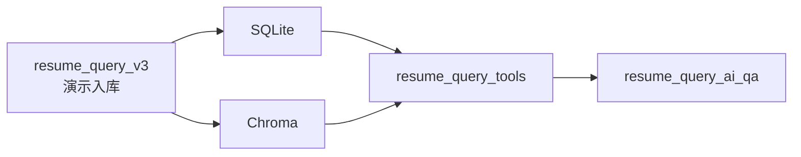

# resume_query_v3

`resume_query_v3` 是演示数据入库和数据底座模块。它把本地简历文件解析后写入：

```text
SQLite: resume_query_v3/data/structured/structured_store.db
Chroma: resume_query_v3/data/vector/chroma_store
```

它为 Query-AI 提供演示数据，不属于问答主链本身。

## 责任边界

| 负责 | 不负责 |
|---|---|
| 扫描本地 demo 简历目录。 | 回答用户问题。 |
| 解析简历结构化字段。 | 判断 Query-AI intent。 |
| 写 SQLite 结构化数据。 | 生成 QueryPlan。 |
| 写 Chroma 项目级证据。 | 组织最终答案。 |
| 为 tools 提供数据底座。 | 前端 Debug 和 trace。 |

## 在主链中的位置



## Demo 边界

当前入库能力服务本地演示：

- 默认读取项目内 `resume_query_v3/resume` 或 API 请求传入目录。
- `POST /ingestion/resumes` 会触发入库流程。
- 文件预览和下载用于演示候选人原简历，不代表生产级文件服务。

生产化前需要补齐：

- 管理接口鉴权。
- 入库目录白名单。
- 路径 containment，禁止任意路径读取。
- 文件大小、类型、扫描频率限制。
- 入库日志脱敏和保留策略。

## 数据给谁用

`resume_query_v3` 写出的数据只应由 `resume_query_tools` 读取。Query-AI 主链不直接
import 入库 pipeline，也不直接访问底层 reader。

## 常用操作

通过 API 触发演示入库：

```bash
curl -X POST http://127.0.0.1:8000/ingestion/resumes \
  -H 'Content-Type: application/json' \
  -d '{"directory":"resume_query_v3/resume"}'
```

健康检查：

```text
GET http://127.0.0.1:8000/health
```

## 扩展原则

- 新解析字段先写入结构化 schema，再由 tools 暴露。
- 新证据粒度先保证 evidence id、source type、candidate id 可追溯。
- 不在入库层写 Query-AI prompt、planner、answer 逻辑。
- 不让前端直接消费入库内部结构，必须经过 API DTO。
