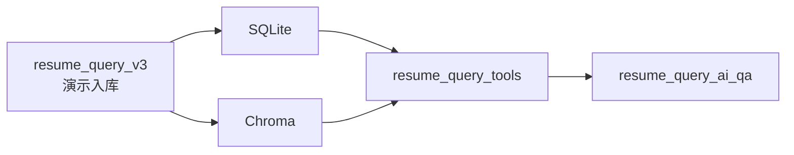

# resume_query_v3

`resume_query_v3` 是这个项目里的数据基座。它不负责“聪明地回答问题”，而是先把简历里的事实做准：候选人是谁、有哪些经历、项目边界在哪里、证据来自哪一段、最后写到了哪里。

这条链路存在的原因很简单：问答系统后面再会推理、再会组织语言，也不能建立在不准的数据上。v3 先把简历变成准确、可追溯、可校验的数据，再交给 Query-AI 主链使用。

本地简历文件会被解析并写入：

```text
SQLite: resume_query_v3/data/structured/structured_store.db
Chroma: resume_query_v3/data/vector/chroma_store
```

这些数据再由 `resume_query_tools` 只读暴露给 `resume_query_ai_qa`。所以 v3 在项目里的位置不是“问答智能”，而是“数据可信度的底座”。

## 入库 node 链路

公开入口仍然是 `run_ingestion_pipeline(...)`，内部按 6 个数据 node 串联：

| Node | 一句话说明 |
|---|---|
| `parse_resume` | 先把文件拆成可追溯的文本块。 |
| `build_rule_candidates` | 用规则抽候选字段、标签和项目边界。 |
| `resolve_with_llm_or_rule_fallback` | 用 LLM 校验/修复边界，失败时保留 rule fallback。 |
| `validate_payload` | 校验置信度、taxonomy 和 evidence。 |
| `apply_storage_gate` | 决定哪些项目事实足够可信，可以入库。 |
| `write_storage_and_artifacts` | 写 SQLite/Chroma，并保留 latest/history 审计产物。 |

完整 flow 说明见 [`FLOW_README.md`](./FLOW_README.md)。

## 我这条链路想表达的设计思想

- 数据先收口：先把简历事实整理成统一 payload，再让下游工具读取。
- 边界先校验：尤其是项目经历，宁可多一步 LLM/rule 检查，也不要把混乱边界直接写入长期存储。
- 证据先落地：字段、标签、项目块都尽量带 evidence block，方便追问、排错和解释。
- 失败也要有边界：LLM 不可用时可以 rule fallback，但 storage gate 仍然会拦截不可信项目。
- 问答只读数据基座：QA graph 不直接 import 入库 pipeline，只通过 tools/API 使用 v3 的结果。

## 责任边界

| 负责 | 不负责 |
|---|---|
| 扫描本地 demo 简历目录。 | 回答用户问题。 |
| 解析简历结构化字段。 | 判断 Query-AI intent。 |
| 校验 taxonomy、confidence、evidence。 | 生成语义计划或选择工具。 |
| 判断项目边界是否可信入库。 | 修复问答运行时状态。 |
| 写 SQLite 结构化数据。 | 生成 QueryPlan。 |
| 写 Chroma 项目级证据。 | 组织最终答案。 |
| 为 tools 提供数据底座。 | 前端 Debug 和 trace。 |

## 在主链中的位置



## Demo 边界

当前入库能力服务本地演示：

- 默认读取项目根目录 `resume/`，并限制扫描目录必须位于该目录内。
- `POST /ingestion/resumes` 会触发批量扫描入库流程。
- `POST /ingestion/resumes/upload` 会上传单份简历到 `resume/uploads/` 并立即入库。
- 文件预览和下载用于演示候选人原简历，不代表生产级文件服务。

生产化前需要补齐：

- 管理接口鉴权。
- 文件安全扫描和上传频率限制。
- 入库日志脱敏和保留策略。

## 数据给谁用

`resume_query_v3` 写出的数据只应由 `resume_query_tools` 读取。Query-AI 主链不直接
import 入库 pipeline，也不直接访问底层 reader。

## 常用操作

通过 API 触发演示入库：

```bash
curl -X POST http://127.0.0.1:8000/ingestion/resumes \
  -H 'Content-Type: application/json' \
  -d '{"directory":"resume"}'
```

上传单份简历并入库：

```bash
curl -X POST http://127.0.0.1:8000/ingestion/resumes/upload \
  -F 'file=@resume/example.pdf'
```

健康检查：

```text
GET http://127.0.0.1:8000/health
```

## 扩展原则

- 新解析字段先写入结构化 schema，再由 tools 暴露。
- 新证据粒度先保证 evidence id、source type、candidate id 可追溯。
- 新入库判断先经过 validation/storage gate，再写入长期存储。
- 新 node 只承接单一数据责任，不把问答 prompt、planner 或 answer 逻辑放进 v3。
- 不让前端直接消费入库内部结构，必须经过 API DTO。
